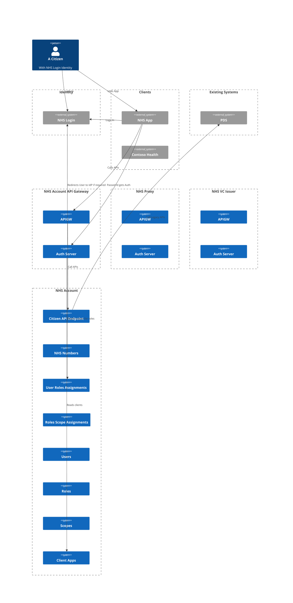

```mermaid
C4Context
  Person(Citizen, "A Citizen", "With NHS Login Identity")
  Boundary(b1, "Identity","")
  {
    System_Ext(NHSLogin, "NHS Login", "")
  }
  Boundary(b2, "Clients","")
  {
    System_Ext(ClientApp, "NHS App", "")
    System_Ext(ContosoClientApp, "Contoso Health", "")    
  }
  Boundary(b3, "Existing Systems","")
  {
    System_Ext(PDS, "PDS", "")
  }
  Boundary(bAPIGW, "NHS Account API Gateway", "") 
  {
    System(APIGW, "APIGW", "")
    System(AuthServer, "Auth Server", "")

  }
 Boundary(proxy, "NHS Proxy", "") 
  {
    System(p1, "APIGW", "")
    System(p2, "Auth Server", "")

  }  
   Boundary(nhsVcissuer, "NHS VC Issuer", "") 
  {
    System(nhsVcissuer1, "APIGW", "")
    System(nhsVcissuer2, "Auth Server", "")

  }  
  Boundary(b0, "NHS Account", "") 
  {
    System(DataApi, "Citizen API Endpoint", "")
    System(NHSN, "NHS Numbers", "")
    System(RoleAssignments, "User Roles Assignments", "")  
    System(RoleScopeAssignments, "Roles Scope Assignments", "")            
    System(Users, "Users", "")
    System(Roles, "Roles", "")
    System(Scopes, "Scopes", "")   
    System(Clients, "Client Apps", "")       
  }

  Rel(Citizen, ClientApp, "Uses App")
  Rel(Citizen, NHSLogin, "Logs In")
  Rel(ClientApp, APIGW, "Calls APIs")
  Rel(ClientApp, NHSLogin, "Logs In")
  Rel(DataApi, PDS, "Call Legacy APIs")

  Rel(APIGW, DataApi, "Call APIs")
  Rel(ClientApp, AuthServer, "Passed Id gets Auth")  
  Rel(AuthServer, NHSLogin, "Redirects User to IdP if required")  
  Rel(AuthServer, RoleAssignments, "Reads scopes for roles")
  Rel(AuthServer, Clients, "Reads clients")    

  UpdateLayoutConfig("8", "3")
```