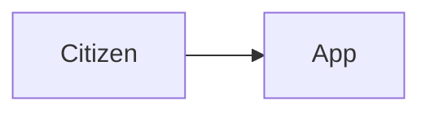
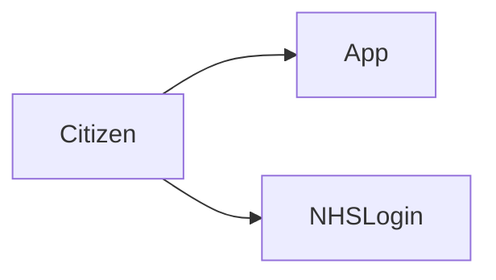
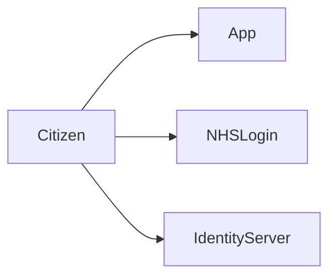
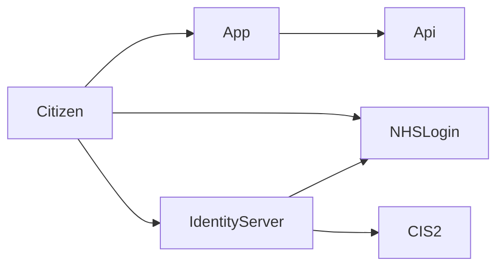
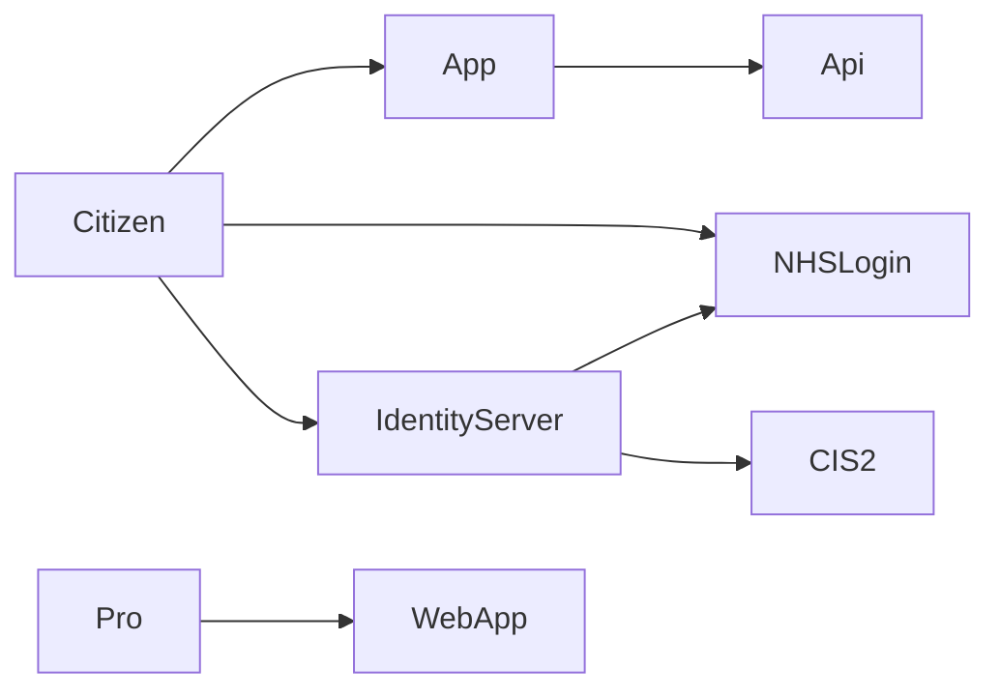
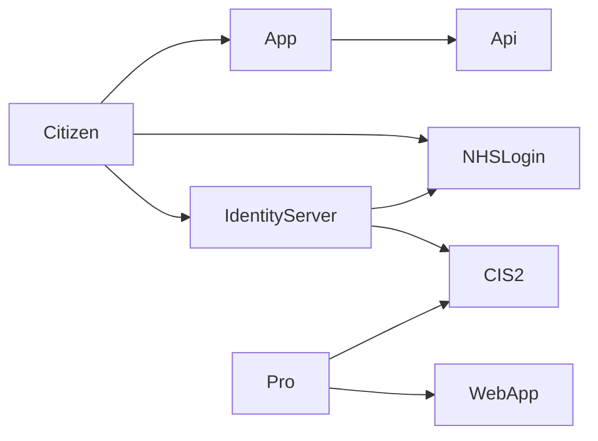

```mermaid
flowchart LR;
    Citizen -->App;
```

---

```mermaid
flowchart LR;
    Citizen -->App;
    Citizen -->NHSLogin;
```

---

```mermaid
flowchart LR;
    Citizen -->App;
    Citizen -->NHSLogin;
    Citizen -->IdentityServer;
```

---

```mermaid
flowchart LR;
    Citizen -->App;
    Citizen -->NHSLogin;
    Citizen -->IdentityServer;
    IdentityServer -->NHSLogin;
    IdentityServer -->CIS2;
    App -->Api;
```

---

```mermaid
flowchart LR;
    Citizen -->App;
    Citizen -->NHSLogin;
    Citizen -->IdentityServer;
    IdentityServer -->NHSLogin;
    IdentityServer -->CIS2;
    App -->Api;
    Pro -->WebApp;
```

---

```mermaid
flowchart LR;
    Citizen -->App;
    Citizen -->NHSLogin;
    Citizen -->IdentityServer;
    IdentityServer -->NHSLogin;
    IdentityServer -->CIS2;
    App -->Api;
    Pro -->WebApp;
    Pro  -->CIS2;
```
