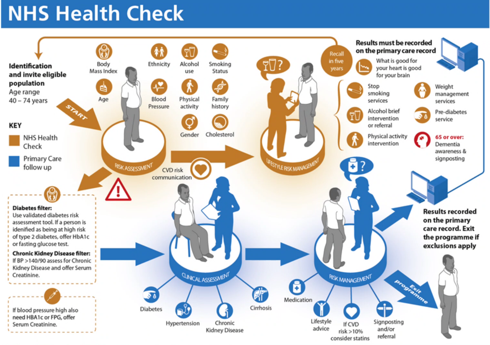
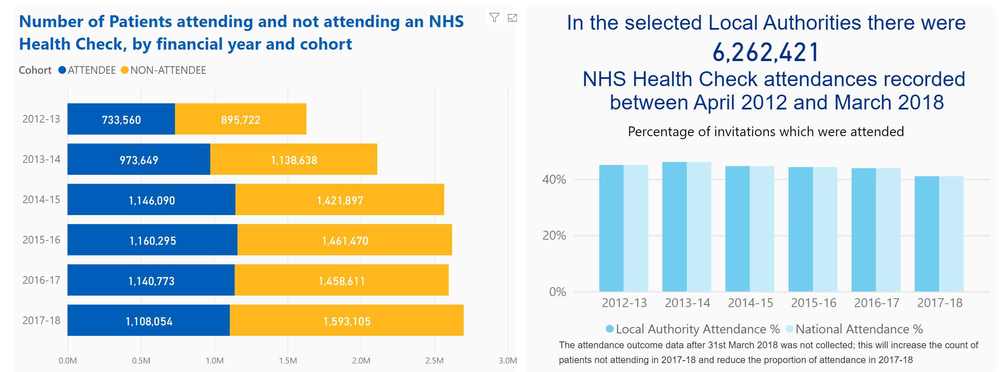
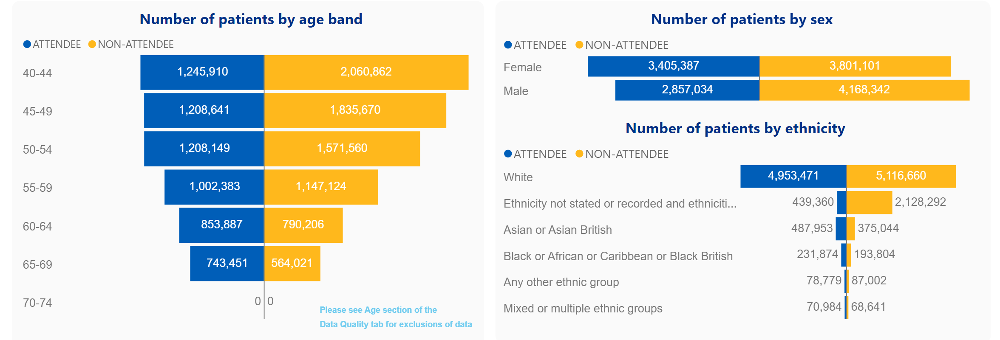
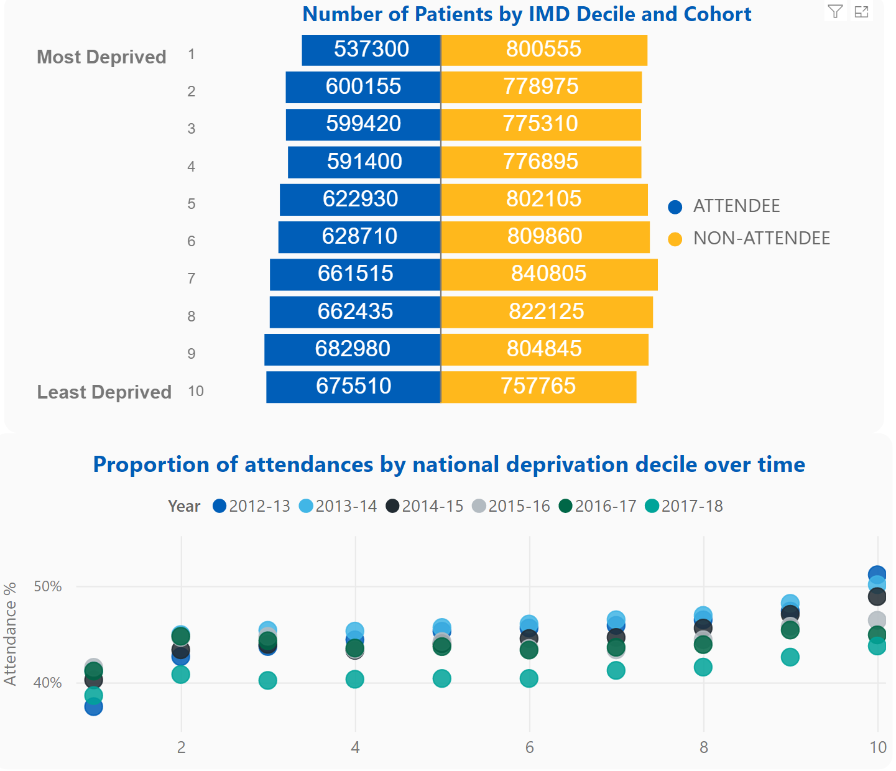

> ⚠️ **Warning**
>  
> **Draft Documents**: May not represent real world scenarios, may not be fully accurate or complete.
>
> Please contact the author for more information.

# Digital Health Check

## Mandate - Why this is being done?

### What is a NHS Health Check
In 2013, local authorities became legally responsible for making provison for eligible 
people to have a check. Between April 2014 and March 2019 over 14 million checks 
(91% of the expected eligible population) were offered, and more importantly, over 6.7
million people had a check: 43% of the five-year eligible population. 

This is a major achievement, however, it does also mean that there is potential to extend the benefits of 
the programme by implementing new approaches which will enable take up of offers to 
go beyond the current level of 48%.

[Health Check Stats 2012 to 2018](https://app.powerbi.com/view?r=eyJrIjoiMjllZTU3MGEtZGQwNC00NzI0LWE5YWEtNTBkNGIwMzBmYjQ2IiwidCI6IjUwZjYwNzFmLWJiZmUtNDAxYS04ODAzLTY3Mzc0OGU2MjllMiIsImMiOjh9)

## Current Status

| Stage     | Date Started | Est End Date | End Date |
| --------- | ------------ | ------------ | -------- |
| Discovery | June 2022    | August 2022  |          |

## Discovery

## Alpha

## Beta

## Production