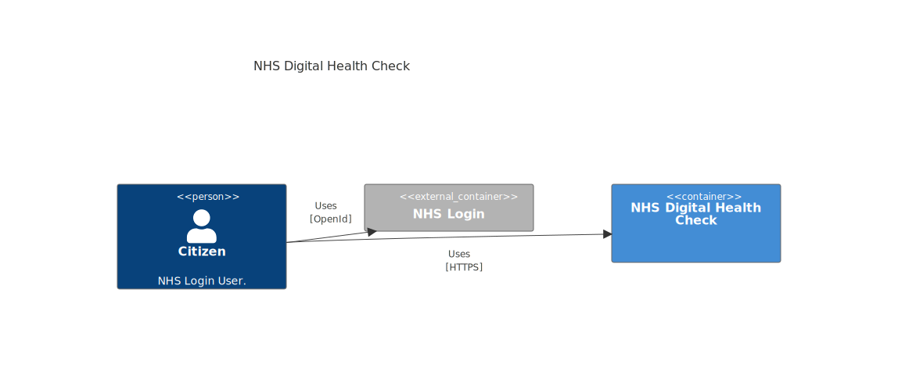

> ⚠️ **Warning**
>  
> **Draft Documents**: May not represent real world scenarios, may not be fully accurate or complete.
>
> Please contact the author for more information.

# Digital Health Check Architecture

## System Context diagram



> ⚠️ *Mermaid support for C4 diagrams is currently limited an does not work in embedded views, so they must be manually exported from https://mermaid.live/ More info can be found at https://mermaid-js.github.io/mermaid/#/c4c*
 
```
    C4Context
      title NHS Digital Health Check
        Person(CitizenA, "Citizen", "NHS Login User.")
        Container_Ext(NHSlogin, "NHS Login", "")
        Container(NHSDHC, "NHS Digital Health Check", "Health Check App")
        Rel(CitizenA, NHSlogin, "Uses", "OpenId")
        Rel(CitizenA, NHSDHC, "Uses", "HTTPS")
        UpdateRelStyle(CitizenA, NHSlogin,  $offsetY="-40", $offsetX="-20")    
        UpdateRelStyle(CitizenA, NHSDHC, $offsetY="20")    
```
