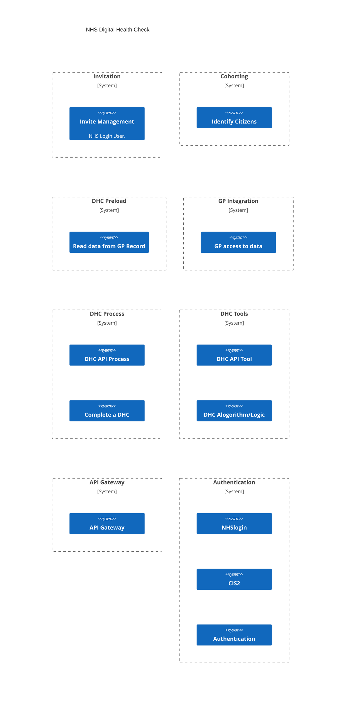
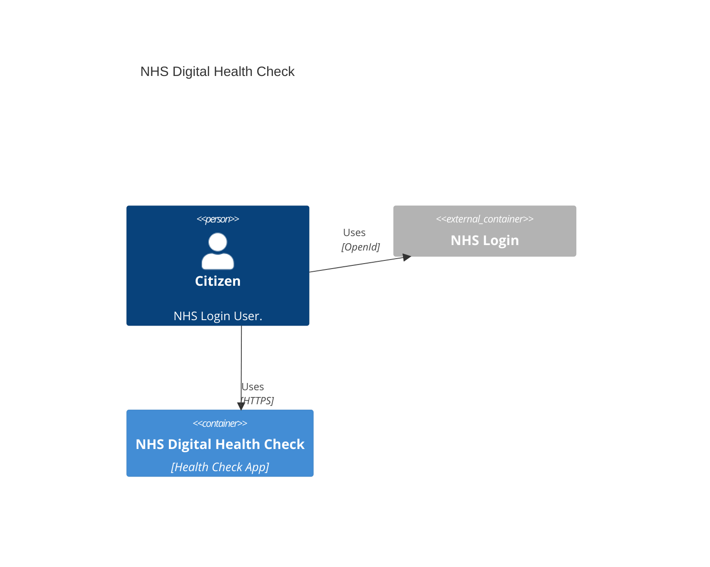

> ⚠️ **Warning**
>  
> **Draft Documents**: May not represent real world scenarios, may not be fully accurate or complete.
>
> Please contact the author for more information.

# Architecture for Citizen Experience
- Ensure all exposed endpoint are easy for Citizen consumption
  - i.e. APIs that are simple and straight forward - i.e. don't assume data standards such as FHIR are useful for Citizens to use
  - OAuth / API management
  - User Consent for Data Use

# Digital Health Check Architecture - Alpha Targets

- Focus on Data and Process 
- Alpha should Focus on clear RESTful API design
- OpenAPI documented API
- API to be 
- API performance parameters to be defined
- User interface "secondary"
- Make data captured available in a User consent Driven way
- Utilizing existing data where possible? *What does use research say on this?*
- CIS2 and NHS L as Identity Providers with standardized authorisation
- API required due to hard GP integration - allow data out via CIS2 oauth.
- Event Driven backend

## Unknown
- Data preloading
- Central Cohort / Invite management

# Whats still needed from Discovery for this?
- Getting data to GP - needs to not be complex - so API driven is way forward
- Make sure Architectural goals align with outcomes of discovery user research

# Teams / squds required
- API, Authorisation & Data Design
- Backend service / event infra 
- APP/UI integration
- GP Integration

## System Context diagram

## System User Interaction

