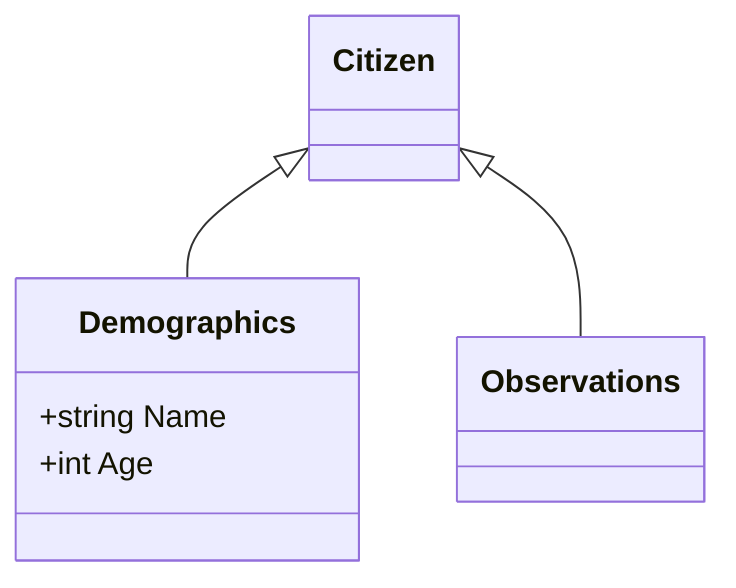

> ⚠️ **Warning**
>  
> **Draft Documents**: May not represent real world scenarios, may not be fully accurate or complete.
>
> Please contact the author for more information.

[View Swaggerhub OpenAPI v3]()

[Swaggerhub Source](https://app.swaggerhub.com/apis/RossBugginsNHS/hc1/v0.1#/)

<iframe width="100%" height="1000px" src="/digital-health-check/data-swagger/html2/">
</iframe>