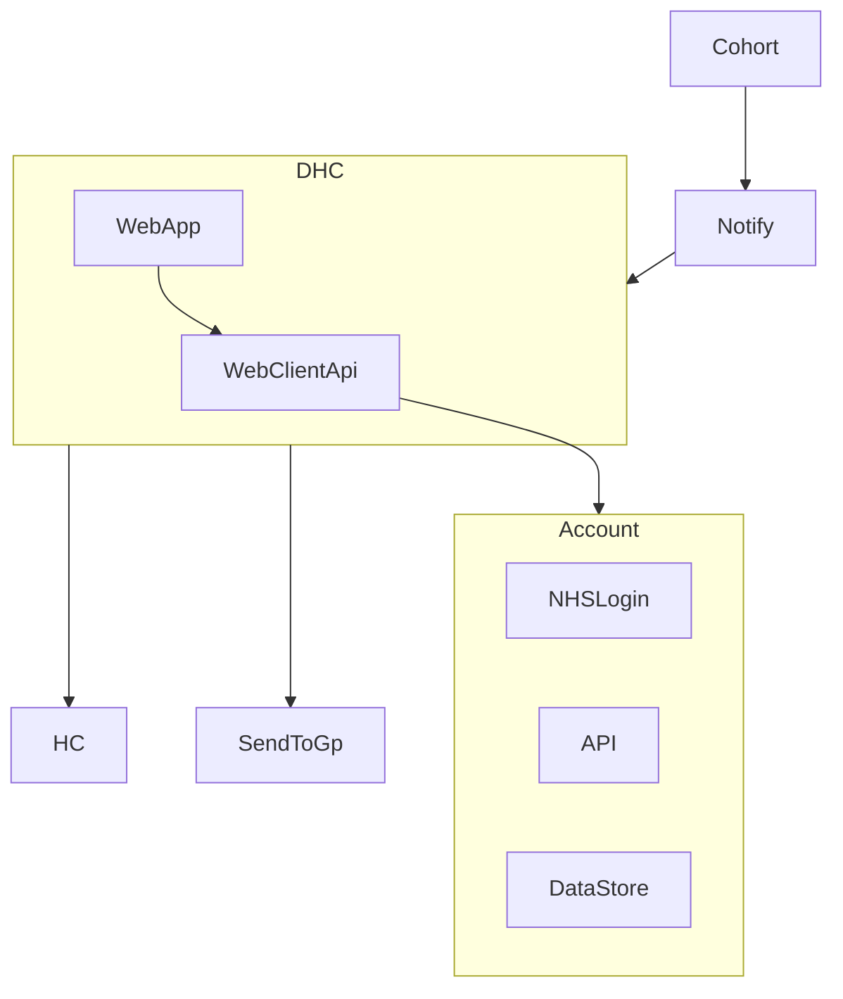
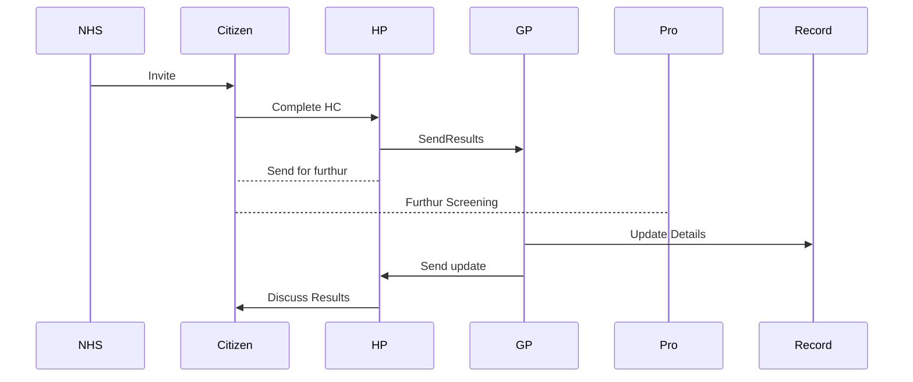
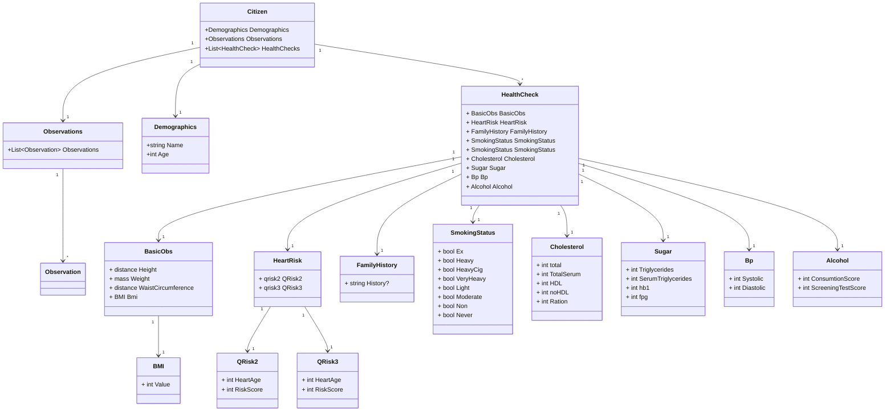

> ⚠️ **Warning**
>  
> **Draft Documents**: May not represent real world scenarios, may not be fully accurate or complete.
>
> Please contact the author for more information.

# Interactions

# Sequence

# Health Check Data Classes

[View Swaggerhub OpenAPI v3]()

[Swaggerhub Source](https://app.swaggerhub.com/apis/RossBugginsNHS/hc1/v0.1#/)

## Data Mapping to SNOWMED Codes

QRISK Snowmed lookup: https://termbrowser.nhs.uk/?perspective=full&conceptId1=810931000000108&edition=uk-edition&release=v20220706

[View it on GitHub]({{ site.gh_edit_repository }}/{{ site.gh_edit_view_mode }}/{{ site.gh_edit_branch }}/{{ site.gh_edit_source }}/_data/dhc-class-properties.tsv){: .btn .fs-5 .mb-4 .mb-md-0 }

<table>
  
    
    <tr>
      
        <th>{{ pair[0] }}</th>
      
    </tr>
    

    
      {{ pair[1] }}
    
  
</table>