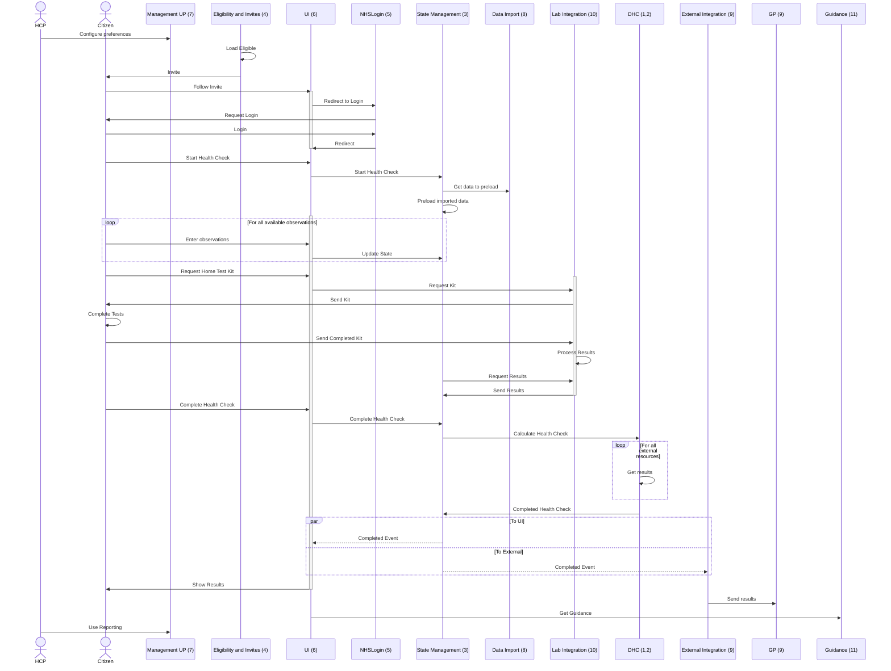
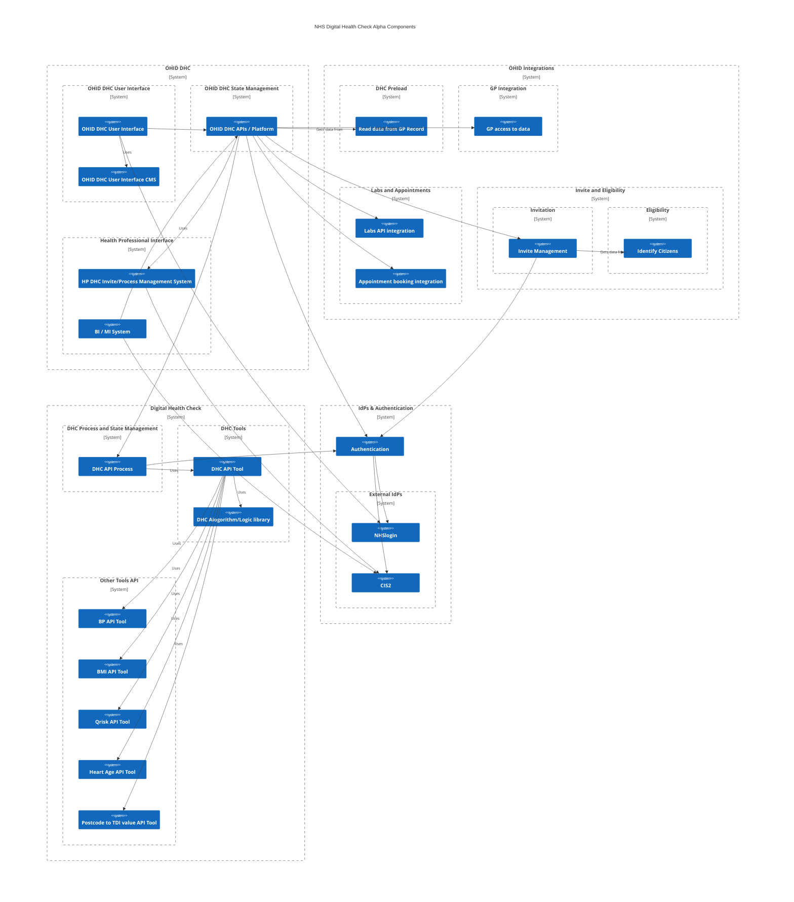
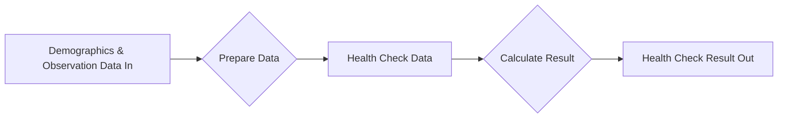
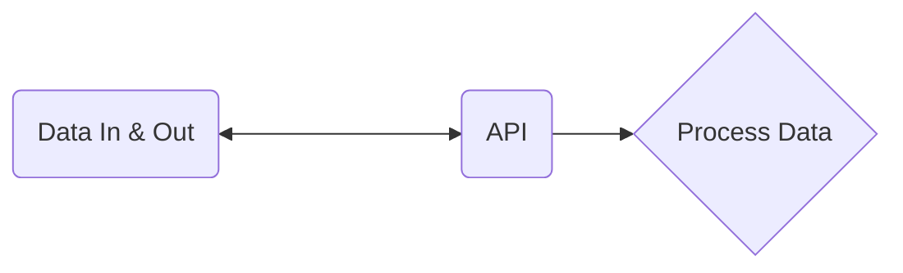
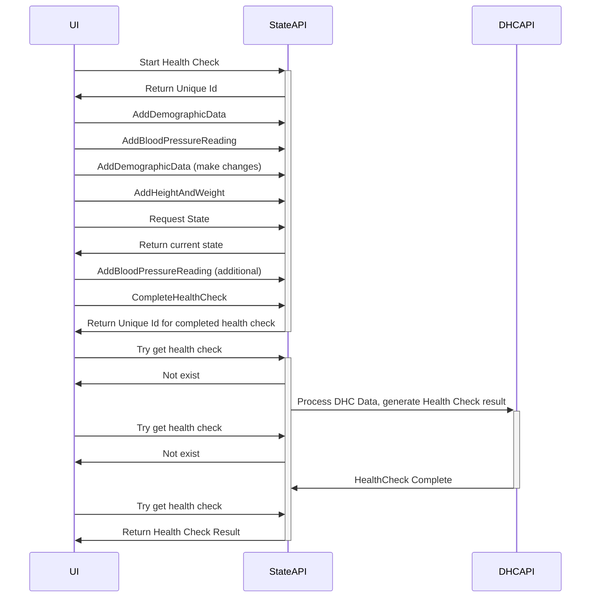

  

    Table of contents
  

  {: .text-delta }
1. TOC
{:toc}

# Summary

The Discovery phase (of the Government Agile Framework) focusses on identifying constraints that may impact the delivery of a service.  This report explores the possible technological constraints.

There are 11 key areas that have been identified during Discovery research. It is suggested that these are all taken into consideration during a technical implementation of the NHS Digital Health Check. 

The technical requirements for the core of Digital Health Check are not novel, or overly complex. A well architected technological implementation should not be a blocker for the progression of this programme. 

The challenges that will be faced are likely to be with the integration options with existing providers of required data; providers of required external services, and those that require to be notified of Health Check results.

From the research (of available material) undertaken in discovery, there is no existing platform that currently provides answers to all of the identified areas. If this programme is put to tender, it is advised that any supplier should be able to provide sound technical explanation to how each of these areas are approached.

The next stage of this programme could include an Alpha phase build - expanding on ideas from existing projects, and exploring areas that have not been addressed in previous work.

The scope for this discovery has been to look at how the current NHS Health Check can be transformed into a digital form. However, further questions could be asked to how a digital version of the Health Check can improve (and add additional benefit) to the current process.

### High Level Discovery Outcomes
- Identified Areas that could be considered as requirements
- No existing provider can provide all areas identified, in terms of functionality and being able to provide a secure, highly available and scalable manner.
- Good UI from previous work
- Core "Calculation" available from previous work
- [GP Integration is not easy]()

### Proposed Targeted Outcomes for an Alpha Phase
- Not expecting a full end to end PoC from an alpha
- Investigate and develop possible solutions for each area identified
- Beta can then take the best options in each area to combine into an end to end Beta solution

# Review of Existing work
Brief summaries of the [Existing systems reviews]() can be read in more details.

# Technical Areas Identified

| Area No | Area to investigate                               | External Dependencies | Estimated Effort for Delta | Summary of Now                                                                            | Ideal Situation                                                                                                                                                                                                      | Delta between now and Ideal                                                                                                                                                                                                                             |
| ------- | ------------------------------------------------- | --------------------- | -------------------------- | ----------------------------------------------------------------------------------------- | -------------------------------------------------------------------------------------------------------------------------------------------------------------------------------------------------------------------- | ------------------------------------------------------------------------------------------------------------------------------------------------------------------------------------------------------------------------------------------------------- |
| 1       | Digital Health Check code library                 | No                    | M                          | Southwark code base can be used as a good starting point                                  | A standard library available for providing a standard calculation for a health check                                                                                                                                 | Utilizing the existing code base for calculations and as a testing comparison for an initial code library. Not a case of just redistributing, there is a requirement for designing a library following common patterns and best practices.              |
| 2       | API for DHC tool                                  | No                    | S                          | Doesn’t exist                                                                             | An reusable RESTful API that consumes raw observation and demographic data and provides a health check result                                                                                                        | PoC API for DHC and supporting required APIs                                                                                                                                                                                                            |
| 3       | API & Service for DHC state management            | No                    | L                          | Doesn’t exist                                                                             | An API platform for managing the ongoing state required for completing a health check over a period of time                                                                                                          | PoC API for managing DHC State                                                                                                                                                                                                                          |
| 4       | Eligibility & Invite integration                  | Yes                   | XL                         | Exists for specific systems, with bespoke identity providers. (Exists in GP systems)      | The automatic invitation of those eligible for a health check. With central provision of the service, but with regional and local management - ie GPs pausing invites or changing frequency and amplitude of invites | Investigate the various ways existing cohort data can be accessed, and how management of invites can be provisioned centrally. PoC API for invite management and how it would work with OHID DHC state management, and standard NHS Identity Providers. |
| 5       | Authorisation                                     | Yes                   | L                          | IdP’s exists, needs api Auth platform. Existing systems use their own identity platforms. | Citizens able to use NHS Login and Health Care Professionals able to use CIS2 for authentication (OpenId) and a standard API authorisation management using OAuth2                                                   | PoC for single Authorisation platform using both NHSLogin and CIS2 as IdPs                                                                                                                                                                              |
| 6       | End user UI                                       | No                    | M                          | Exists in various forms                                                                   | Reactive UI that can be used in mobile or desktop, for complete end to end DHC completion                                                                                                                            | UI that allows configuration for user research of best layout. Existing and previous platforms have UI's that can be adapted for User Research and development                                                                                          |
| 7       | Health Care Professional UI                       | No                    | L                          | Doesn’t exist                                                                             | A UI for HCPs to manage invites to DHCs                                                                                                                                                                              | PoC UI for invite management                                                                                                                                                                                                                            |
| 8       | Pre load health data integration                  | Yes                   | L                          | No platforms have provided evidence of data pre loading                                   | All relevant data loaded from existing health records, ie recent test results, observations, and Spine demographics data. With support of Citizen generated IOT devices - ie mobile app and wearables                | Investigate the various ways existing data can be accessed and integrated into the process.                                                                                                                                                             |
| 9       | Export to GP integration                          | Yes                   | XL                         | Exists with some providers                                                                | Results of DHC automatically added to a patients GP data record.                                                                                                                                                     | Investigate the various ways existing data can be exported, with an aimed understanding of short, medium and long term options. Decide where the south of truth should be                                                                               |
| 10      | Blood Test Labs / appointment booking integration | No                    | XL                         | Exists in some form                                                                       | Integration to send requests for home blood kits, and to retrieve results from any lab. Book appointments with GPs/pharmacies/other providers for face to face testing, and API to receive results directly.         | Investigate the different providers and ways of integration                                                                                                                                                                                             |
| 11      | Output guidance - localized customization         | Yes                   | L                          | Basic directory of services                                                               | A GP may want to advertise service x after a health check, a ccg might want to advertise y                                                                                                                           | Investigate what exists in more details & how to manage at multiple levels                                                                                                                                                                              |

### Component Interaction Process

### Component Interaction Considerations

## 01. Digital Health Check Library Code
At its core, a Digital Health Check is:

A build alpha could aim to making this available in a open source digital form (whether an API, or  just a code library that can be used in a CLI) ensuring any future work can cleanly and easily build upon this.

The perceived complexities for a Digital health Check come from where the "Data In" will come from, and where the "Data Out" will go. 

> **Area 01 Summary** 
> 
> Idempotent Library for Calculating DHC results from provided prepared data

## 02. Digital Health Check Tool API 
The development of an API first designed system that is just a simple Tool for returning the results of a full set of Health Check data. This will be stateless and can be used by the Digital Health Check Service, both internally and externally. This is a key concept to allowing the DHC work to be reused, and re worked, in the future.

> ### Technical considerations for APIs
> - *Easy data model, including for those who are not Health IT Professionals* 
> - *RESTful*
> - *Swagger/OpenAPI "design first"*
> - *Asynchronous, use of Location Header*
> - *Clear metric and performance requirements for all API calls*
> - *OAuth claims scoping*
> - *Semantic Versioning*
> - *End of Life per version*

### Data Modelling
The tooling APIs should accessible and be intuitive for all to use. "I, as a citizen with some technical understanding" should be able to call the Digital Health Check tool API and receive a result.

As such, there must be though given to if a FHIR data model is the best way to go forward for public APIs that are focussed on the Citizen consuming them.

FHIR has a key place in inter health system communication, but it is likely to be perceived as bloated and overly complex for exposing APIs to Citizens.

An outline of [Health Check Data]() expands this further.

> **Area  02 Summary** 
> 
> API for consuming observation and demographic data, preparing data, and calculating DHC result 
>
> Including separate APIs for any preparation - ie BMI calculation and QRisk required data conversions

## 03. Health Check State Management

Previous reviewed work has kept state management of the Health Check (W&P also did this) process inside the User Interface. Instead of this approach, an API driven process could be used, alongside Event Sourcing for state management.

The benefit of this approach is that the User Interface becomes nothing but a graphical window to the logic of the process. This allows the whole process to be directly integrated with any other application, present or future – including custom integration if local regions wanted to provide the health check in there own systems or apps, but with full visibility for all inside the central NHS UK, NHS app or other central app.

It will also allow for clear reporting for the exact current state of progress for all health checks.

### Example sequence for using a state management API for DHC

> **Area 03 Summary** 
> 
> API platform for managing state of a "long lived" Digital Health Check process

## 04. Invite Management

Invite management can be separated into two stages, first the collating who is eligible for a health check (based on Age and past medical history). The second stage is then a decision if to send an invite.
Currently this process is performed locally at a GP level. It is suggested that ideally both processes are moved centrally.

The first benefit of moving the identification of eligibility and invite centrally are for reporting purposes. There is then one central clear picture of both historical and real time health check status.  The eligibility and invite management could also be used for tracking non digital health checks.

Any invite system should consider the unique needs of local regions, GP federations, GP Surgeries and individual GPs. It is proposed that any solution should include the ability for configuration of invite sending at any of these levels. 

For example, a region may want to default to send by default 10 Health Check invites per GP surgery per week. However, a specific surgery might want to completely pause invites, and another might want to send invites to all those eligible. 

Any management system that requires a health professional to use, should utilise existing identity providers so there is not a requirement of yet another login. It is suggested that CIS2 (with existing usernames and smartcards) is the preferred option.

> **Area 04 Summary** 
> 
> Platform for managing selection of eligibility and digital invites.

## 05. Authorisation   
With NHS Login for citizens, and CIS2 for health care professional’s (and even nhs.net for wider NHS staff) all supporting OpenId – there is no need for any new platform to need its own Identity. 

With the possibility of this programme requiring both HCP and Citizen login, a single authorisation platform should support both of the NHS OpenID IdPs, with it being used to protect the API resources directly.

> **Area 05 Summary** 
> 
> Platform for allowing logins to the UI component from multiple IdPs (NHS Login and CIS2).

## 06. User Interface
Any digital health check system should be totally platform agnostic. It should work in a web browser or mobile or desktop and also through native apps. This can be supported through an API driven platform.
There are a number of existing user interfaces that follow the pattern that is needed for a Digital Health Check. 

There is the [NHS Wellness and Prevention Alpha](https://wp.nhsei.xyz), which has a fully responsive UI and also the [Southwark DHC UI](https://stagingsouthwarkdhctest.qxlva.io) which follows the standard GDS layout (with asp dotnet core Blazor components).

> ### UI & Integration
> 
> Many NHS digital programme requirements start with statements such as "must integrate with NHS App", or " must integrate with NHS.uk". 
> 
> Requirements such of this can be appreciated, however architectural and development work should think to take this further.
> 
> Focus on digital solutions should not just be on where they envisaged to be used right now. The NHS App in it's current form will not be available for ever; neither will the NHS.UK web site. 
> 
> Digital solutions **MUST** be developed with a clear API first focus, that can then be integrated with the NHS app, or any other app (or web site) that may be specified in the future.

There should also be thought into the customising of the User Interface – if a region wants a varied UI – do they create their own and utilised the central APIs, or does the centrally provided UI allow some level of customisation depending on region?

> **Area 06 Summary** 
> 
> Citizen focused UI for completing health checks.

## 07. Health Care Professional UI
In addition to citizens requiring a UI for completing a Heath check, there is a requirement for HCP to have a UI. This could be used for both ends of the process – both for invite management and also reporting and MI needs.

Again, like the citizen user interface, ideally this would be a wrapper over a fully API driven application, allowing ease of integration with other systems, such as GP specific platforms and Business Intelligence platforms.
 
> **Area 07 Summary** 
> 
> HCP focussed UI for invitation management and reporting of Health Checks.

## 08. Pre loading data service
The lack of a single source of truth for data inside the NHS leads to problems when looking for data to consume. Can data be loaded from a GP? A Local trust PAS? From central Spine? From NHS Account? Should data be gathered from citizens own collected wearables data?

With a focus on GP systems, this itself is not simple. There is a separate review of [GP integration options](% link digital-health-check/gp-integration.md %) that goes into more detail.

Pre loading of data from a citizens medical record into a digital health check is not just a technical question, but also a process one. If the technical hurdles are overcome, what data should be loaded? Data from wearables? Data from a blood test last week, or last month? Height and weight?

> **Area 08 Summary** 
> 
> Pre loading of data into health check from existing medical record data.

## 09. Export to GP
Technical solutions for providing health check results not only should address the technical challenges, but also over what control is given GPs over the consumption of the data. If a fully automatic system was in place centrally, there could be cases where some GPs do don’t want all results to be automatically added to a patients record.

As with reading data from GP IT systems, writing results to them is also not simple. There is a separate review of GP integration options [GP integration options](% link digital-health-check/gp-integration.md %) that goes into more detail.

The technical challenges of centrally writing directly into GP IT systems, there should be consideration into the difference between providing results to a GP through a separate management system vs directly exporting them – how this could be applied to short, medium and long term plans.

> **Area 09 Summary** 
> 
> Supplying GPs with results from Digital Health Checks.

## 10. Blood Test Labs integration
The level of integration available with labs providing testing will vary with the level of customisation required. It may be different regions require different labs, and some may use centrally pooled resources. 

The on going management t of this also needs to be considered, should regions be able to dynamically change the lab in use? There is also a question of if the service could be opened to people outside of the standard age range, and give the option of payment for ordering a test at home lab kit.

There needs to be identified a pool of labs that would likely be used, and then further investigation into the integration that is available, both for ordering of kits and getting results.

> **Area 10 Summary** 
> 
> Ordering of test at home kits and collecting of status and results

## 11. Output guidance & local customization
Once a health check is completed, there is a requirement to provide next step guidance. Thought should be given to how localised this guidance needs to be. Should a GP be able to have the ability to signpost those at their surgery that have a high blood pressure to a local clinic or service?

This possible requirement could lead to a "Multi-tenant" style solution, where different areas and regions appear to be independently managed, but are run on the same underlying platform.

> **Area 11 Summary** 
> 
> Customising output guidance based on local requirements.

# Conclusion

This report has identified key areas to aid in the planning of the technical implementation for a Digital NHS Health Check. If the chosen way forward considers each of these areas, it can then be developed in an iterative and incremental way; helping to future proof itself for change by having extensibility and interoperability at the core of its processes.

Integration with existing NHS systems (and wider health provider platforms) is not as easy as it should/could be. This programme could consider not just what is required (and available) now but what could be required (and made available) into the future.

There has been extensive work in previous central programmes (as well as local and commercial offerings) that align with the core aims of the NHS Digital Health Check. Building upon these can provide NHS Digital Health Checks from a central platform that can be managed and configured locally.

Existing projects do already have answers to some identified technical areas, but scoped for a local region only. The requirement for these is how best scale this to work at a national level, but keeping localized management of these features. 

For a complete "ideal" end to end Digital Health Check, there are challenges to be overcome (mainly around integration). However, that should not stop the Digital Health Check from being viewed as a viable programme. The areas identified can be approached in an Agile way, with both iterative and incremental advances always aiming to deliver benefit. With clear architecture for an extensible solution, a technical solution can be in place to allow the core components of Digital Health Check to be built upon as integration options allow.

Each of the areas identified can be though of as a Feature (in an Agile Framework). With a benefit hypothesis process undertaken for each of these, the proposed measurable benefit to the citizen and the organisation can be discovered. This can then shape the next phases, through prioritisation and feature estimation.

Initial requirements for "digitizing" a non digital project often start with a desire to duplicate the existing process, with a belief this will be the easiest option. It is often quite the opposite, and consideration should be given to how digital can shape and refine an existing process. This often brings benefit to both the end user and the organization.

For an NHS Digital Health Check, a question that could be asked is *"Now the process is Digital, should the Health Check be open to all? (as opposed to 40+)"*. A benefit to the citizen could be improved health through better prevention from more frequent self testing. This would also lead to more data being collected centrally about individuals on a more frequent basis. This can then lead to benefits for the organisation through advanced prevention by not only looking at the situation for a citizen now, but by comparing results easily to previous Health Checks, utilising detection of unique trends for each citizen individually.

# Appendix

## Appendix 1: Additional Technical Considerations

### Extensibility
- Events and APIs
- API first, use swagggerhub for api design and bolilerplate code generation 
- EoL and [Semantic Versioning]()

### Deployability
- Docker build and deploy files
- Kubernetes and helm charts
- Local development, vscode remote container docker compose config - containing all required resources.

### Capacity and Scale Discovery
- Inter service communication / event bus / command handlers etc
- Storage Platform
  
#### Should consider

- Find out how many health checks per day
- How many NHS Logins (total/active)
- How much use if used as invite only vs accessible to all

## Appendix 2: Example Microservice Design for DHC 

