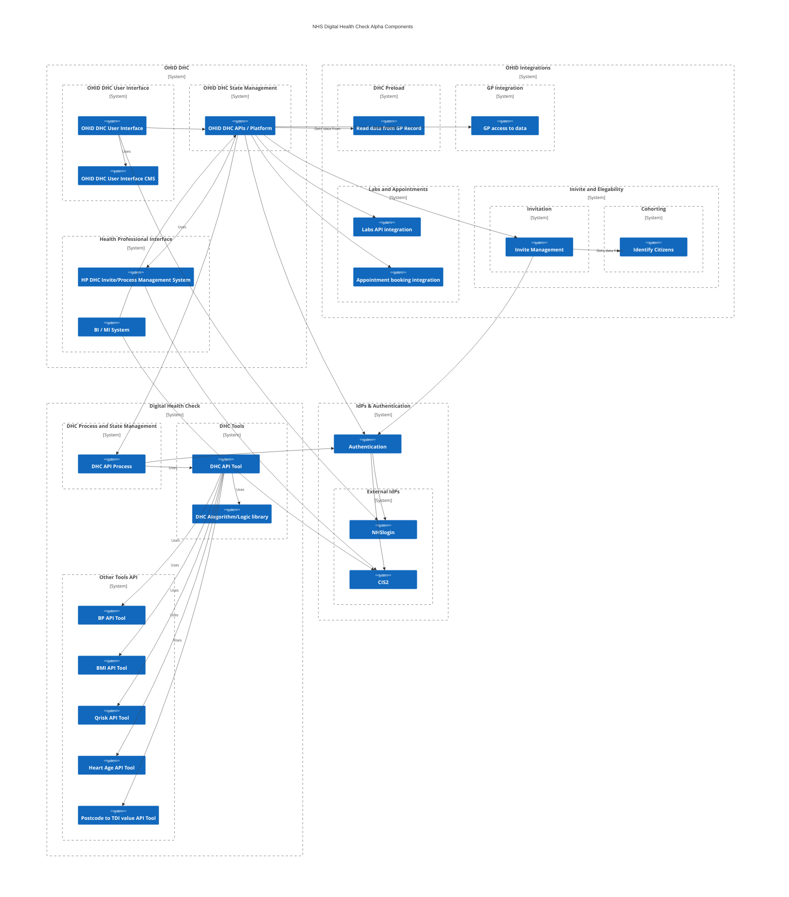
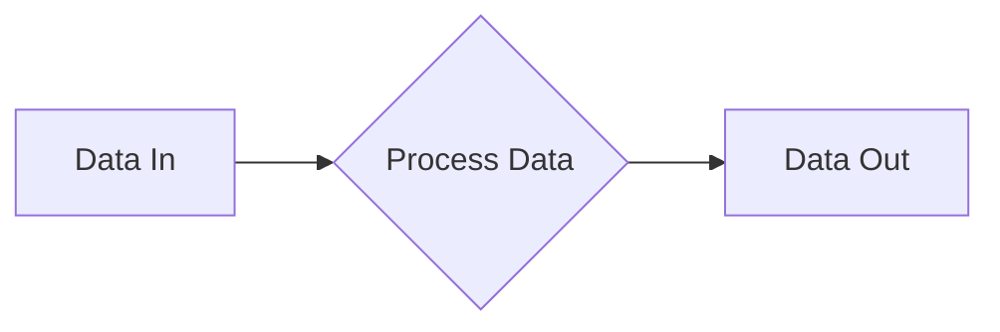
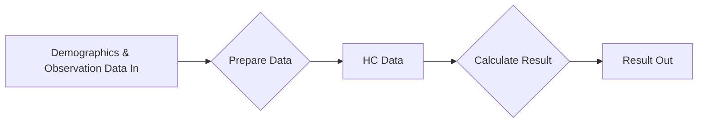
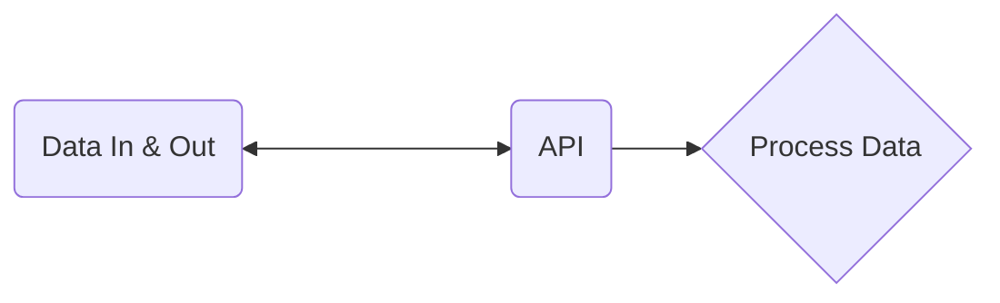
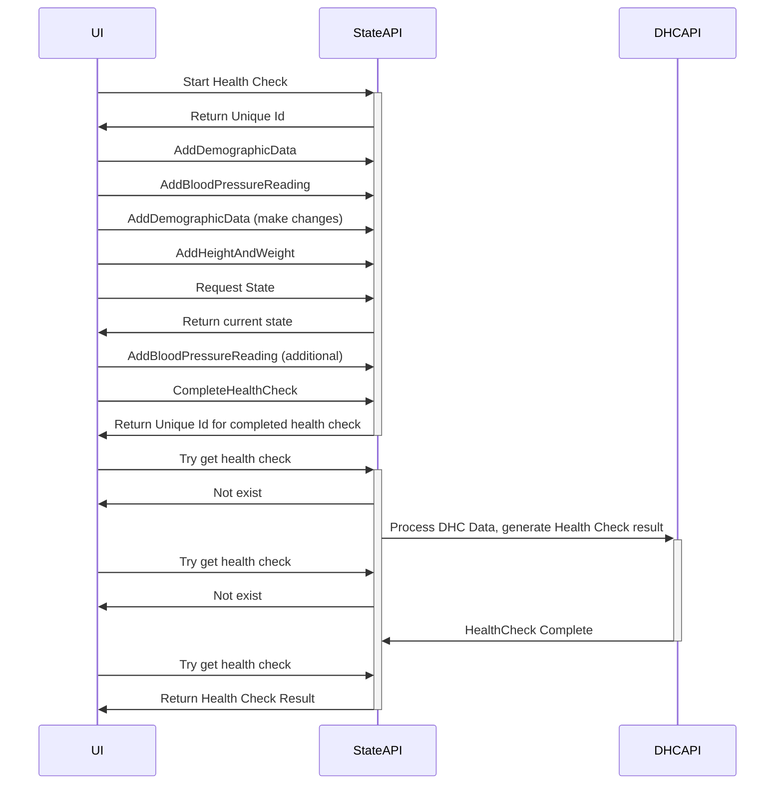
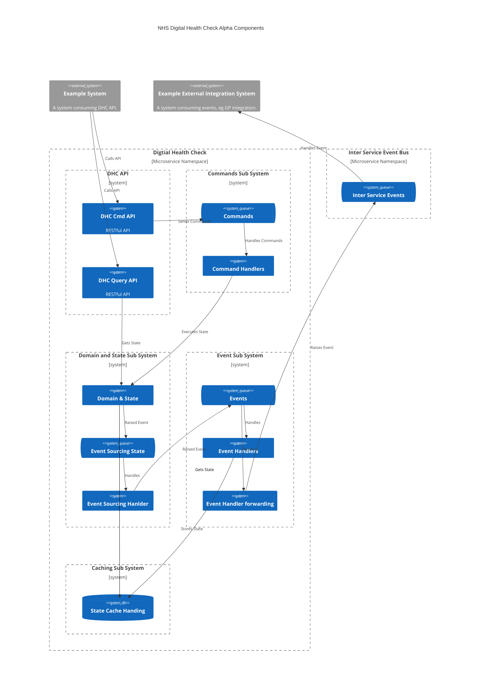

> ⚠️ **Warning**
>  
> **Draft Documents**: May not represent real world scenarios, may not be fully accurate or complete.
>
> Please contact the author for more information.

<details open markdown="block">
  <summary>
    Table of contents
  </summary>
  {: .text-delta }
1. TOC
{:toc}
</details>

## Summary

A Discovery process in the Government Agile Framework included focussing on identifying constraints that may impact delivering the service, including possible technological constraints. 

There are a number of clearly defined boundaries within the overall scope of this programme. The next stages of this programme could include an Alpha Build, which could include existing ideas and code from existing and previous projects - with Agile delivery through incremental and iterative feature development in each of these areas.

From the research undertaken in discovery, there appears to be no existing platform that can provide clear solutions to all of the areas that have been identified. If this programme is put out to tender, it is advised that any supplier should be able to provide sound technical explanation to how each of these areas are approached.

There are  identified high level boundaries, grouping the identified areas and components. Some of these boundaries contain components that are OHIC DHC specific, others contain components that could be utilised elsewhere / by other programmes in the future.

The technical requirements for the core of Digital Health Check are not novel, or overly complex. A well architected technological implementation should not be a blocker for the progression of this programme.

However, the challenges faced are likely to be with the integration options with existing providers of required data, providers of required services, and those that require to be notified of Health Check results.

The scope for this discovery has been to look at how the current NHS Health Check can be transformed into a digital form. However, questions could be asked to how a digital version of the Health Check can improve and add additional benefit to the current process.

### High Level Discovery Outcomes
- Identified Areas that could be considered as requirements
- No existing provider can provide all areas identified, in terms of functionality and being able to provide a secure, highly available and scalable manner.
- Good UI from previous work
- Core "Calculation" available from previous work
- GP Integration is not easy

### Proposed Targeted Aplha Outcomes
- Not expecting a full end to end PoC from an alpha
- Investigate and develop possible solutions for each area identified
- Beta can then take the best options in each area to combine into an end to end Beta solution


# Review of Existing work
Brief summaries of the [Existing systems reviews]() can be read in more details.

# Technical Areas Identified


| Area No | Area to investigate                               | Summary of Now                                           | Ideal Situation                                                                                                                                                                                              | Summary of hoped aplha outcome / Delta                                             |
| ------- | ------------------------------------------------- | -------------------------------------------------------- | ------------------------------------------------------------------------------------------------------------------------------------------------------------------------------------------------------------ | ---------------------------------------------------------------------------------- |
| 01      | Digital Health Check code library                 | Southwark code base can be used as a good starting point | A standard library available for providing a standard calculation for a health check                                                                                                                         | Simple reusable DHC library                                                        |
| 02      | API for DHC tool                                  | Doesn't exist                                            | An reusable RESTful API that consumes raw observation and demographic data and provides a health check result                                                                                                | PoC API for DHC and supporting required APIs                                       |
| 03      | API for DHC state management                      | Doesn't exist                                            | An API platform for managing the ongoing state required for completing a health check over a period of time                                                                                                  | PoC API for managing DHC State                                                     |
| 04      | API for invite management                         | Exists for specific systems                              | A platform for managing invites to complete the DHC                                                                                                                                                          | PoC API for invite management and how it would work with OHID DHC state management |
| 05      | Authorisation                                     | IdP's exists, needs api Auth platform                    | Citizens able to use NHS Login and Health Care Professionals able to use CIS2 for authentication (OpenId) and a standard API authorisation management using OAuth2                                           | PoC for single Authorisation platform using both NHSLogin and CIS2 as IdPs         |
| 06      | End user UI                                       | Exists in various forms                                  | Reactive UI that can be used in mobile or desktop, for complete end to end DHC completion                                                                                                                    | UI that allows configuration for user research of best layout                      |
| 07      | Health Care Professional UI                       | Doesn't exist                                            | A UI for HCPs to manage invites to DHCs                                                                                                                                                                      | PoC UI for invite management                                                       |
| 08      | Pre load service                                  | ??                                                       | All relevant data loaded from existing health records                                                                                                                                                        | Investigate the various ways existing data can be accessed                         |
| 09      | Export to GP Service                              | Exists with some providers                               | Results of DHC automatically added to a patients GP data record                                                                                                                                              | Investigate the various ways existing data can be exported                         |
| 10      | Cohorting / Invite Service                        | Exists in GP systems                                     | Daily list of all those eligible for a DHC                                                                                                                                                                   | Investigate the various ways existing cohort data can be accessed                  |
| 11      | Blood Test Labs / appointment booking integration | Exists in some form                                      | Integration to send requests for home blood kits, and to retrieve results from any lab. Book appointments with GPs/pharmacies/other providers for face to face testing, and API to receive results directly. | Investigate the different providers and ways of integration                        |
| 12      | Output guidance - localized customization         | Basic directory of services                              | A GP may want to advertise service x after a health check, a ccg might want to advertise y                                                                                                                   | Investigate what exists in more details & how to manage at multiple levels         |

Some of these components will be OHID specific, others could be available for other providers who wish to use the same Digital Health Check "Engine".

#### Other considerations
- Storage Platform
- Inter service communication / event bus / command handlers etc

Many NHS digital programme requirements start with statements such as "must integrate with NHS App", or " must integrate with NHS.uk". Requirements such of this can be appreciated, however architectural and development work should take this and expand to really see the requirement for what it is. Focus on digital solutions should not just be on where they envisaged to be used right now. The NHS App in it's current form will not be around for ever, neither will the nhs web site. Digital solutions MUST be developed with a clear API first focus, that can then be integrated with the NHS app, or any other app.

### Component Interaction Considerations




## Digital Health Check Library Code
At its core, a Digital Health Check is nothing more than:



And can be further broken down into:



A build alpha could aim to making this available in a open source digital form (whether an API, or  just a code library that can be used in a CLI) ensuring any future work can cleanly and easily build upon this.

The perceived complexities for a Digital health Check come from where the "Data In" will come from, and where the "Data Out" will go.

At its most basic, it should be a simple idempotent library. 
Note for idempotent methods, thought should be given to not using variable types such as Dates, instead age in days should be used - ensuring that the same data payload always returns the same result, no matter what the date is today.

```csharp
public HealthCheckResult CalclateHealthCheck(HealthCheckData value)
{
    //Calculate health check and return result.
    throw new NotImplementedException();
}
```

> **Area 01** 
> 
> Idempotent Library for Calculating DHC results from provided prepared data
>
>
> 
> .

### Incremental Health Check Library Development, Possible Routes
- Start with just basic checks - add more data over time?
- Require all data for a result vs Can give result with partial data?
- Should some be separate libraries / APIs? BMI for example? Blood pressure result?
- 

## Digital Health Check Tool API 
The development of an API first designed system that is just a simple Tool for returning the results of a full set of Health Check data. This will be stateless and can be used by the Digital Health Check Service, both internally and externally. This is a key concept to allowing the DHC work to be reused, and re worked, in the future.



### Key considerations for all APIs
- Easy data model, including for those who are not Health IT Professionals 
- RESTful
- Asynchronous, use of Location Header
- Clear metric and performance requirements for all API calls
- OAuth claims scoping
- Versioning
- End of Life

### Data Modelling
The tooling APIs should accessible and be intuitive for all to use. I, as a citizen with some technical understanding, should be able to call the Digital Health Check tool API and receive a result.

As such, there must be though given to if a FHIR data model is the best way to go forward for public APIs that are focussed on the Citizen consuming them.

FHIR has a key place in inter health system communication, but it is likely to be perceived as bloated and overly complex for exposing APIs to Citizens.

An outline of [Health Check Data]() expands this further.


> **Area  02** 
> 
> API for consuming observation and demographic data, preparing data, and calculating DHC result 
>
> Including separate APIs for any preparation - ie BMI calculation and QRisk required data conversions
> 
> .

## Health Check State Management

Previous reviewed work has kept state management of the Health Check (W&P also did this) process inside the User Interface. Instead of this approach, an API driven process could be used, along side Event Sourcing for state management.


### Example sequence for using a state management API for DHC


> **Area 03** 
> 
> API platform for managing state of a "long lived" Digital Health Check process
>
>
> 
> .

## Invite Management

> **Area 04** 
> 
> API platform for managing state of a "long lived" Digital Health Check process
>
>
> 
> .


## Invite Management   

In contrast to local soloutions to Digital Health Check, nationally there would need to be a way for different GPs, GP Federations, Local Authorities, to manage their invite process in  differently schedules, and possibly different criteria requirements.


> **Area 05** 
> 
> API platform for managing invites to DHC
>
>
> 
> .


# Additional Technical Considerations

### Example Microservice Design for DHC 




### Capacity and Scale Discovery
Should consider:
- Find out how many health checks per day
- How many NHS Logins (total/active)
- How much use if used as invite only vs accessible to all

### Open Source
All development work should be open source from the very start of any beta stage.

### Development Recommendations
- VSCode remote development containers for each project
- Docker build and deploy files
- API first, use swagggerhub for api design and bolilerplate 