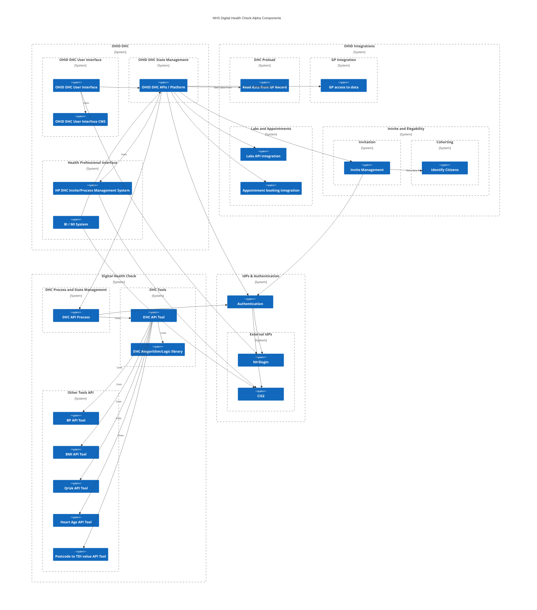
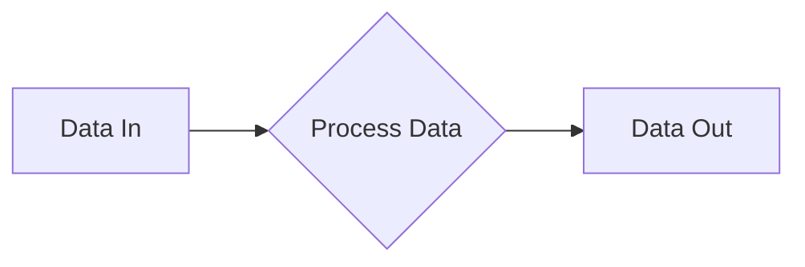
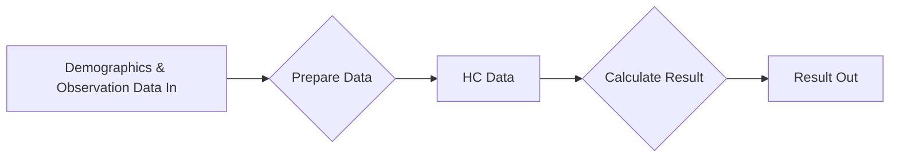
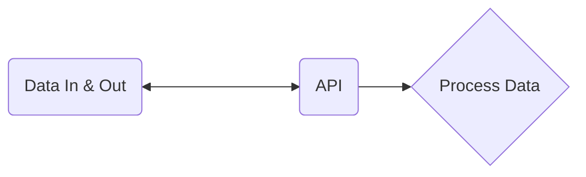
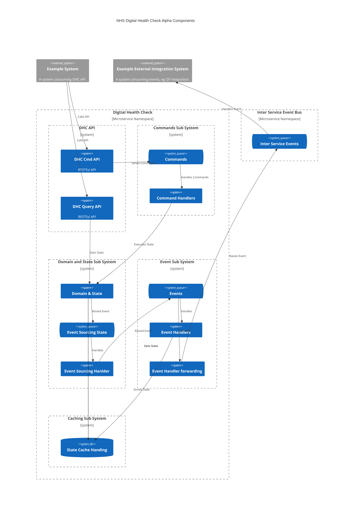

> ⚠️ **Warning**
>  
> **Draft Documents**: May not represent real world scenarios, may not be fully accurate or complete.
>
> Please contact the author for more information.

# Digital Health Check - Discovery - Technical


## Key Items to address
- Identify possible technical hurdles
- How to ensure DHC discovery/future alpha/beta work is reusable easily
- Any key patterns & practices to follow
- Identify any components of existing system that could be utilised / reused in alpha
- Overview of data model
- GDPR / Data - NHS-E as data controller for PII???? (not technical?)

## Status

| Todo                                                                | Status        |
| ------------------------------------------------------------------- | ------------- |
| Previous System's Architecture Review                               | ⚠️ in progress |
| Scope Required Data Model                                           | ⚠️ in progress |
| Identity / Authorisation Options                                    | ⚠️ in progress |
| Any Future Questions for User Research                              | 🕐 Pending     |
| Identify any technical hurdles                                      | 🕐 Pending     |
| Propose any technical patterns that could /should be followed       | 🕐 Pending     |
| Identify how DHC could be broken down into separate systems/modules | 🕐 Pending     |

### Technical Hurdles

| Todo                          | Status        |
| ----------------------------- | ------------- |
| GP Integration Options        | ⚠️ in progress |
| Cohort & Invite Management    | 🕐 Pending     |
| Pre load from GP record       | 🕐 Pending     |
| Self load data from wearables | 🕐 Pending     |


# DHC Technical Discovery Review

**TODO - Write a summary encompassing all work that has been completed as part of the Technical Discovery**

## Summary

The technical requirements for a Digital Health Check are not novel, or overly complex. A well architected technological implementation should not be a blocker for the progression of this programme.

There are a number of clearly defined boundaries within the overall scope of the programme, that will allow for Agile delivery through incremental and iterative feature development.

### Discovery outcomes
- Good UI from previous work
- GP Integration = hard
- Question still to be answered - how can digital improve upon and give more benefit that manual health check - instead of just trying to make a carbon copy of existing process
- Question still to be answered - preloading of data
- Question still to be answered - Data in GP record vs data available to GP - what would GP's want / expect
- Question still to be answered - Invite and cohort management
- Component Structure for Alpha - National scalable concerns

### Proposed Aplha Outcomes
- Not targeting a full end to end alpha
- Investigate and develop possible solutions for each Area identified
- Beta can then take the best options in each area to combine into an end to end Beta solution
#### Alpha Areas Identified

| Area No | Area to investigate                               | Summary of Now                        | Ideal Situation                                                                                                                                                                                              | Summary of hoped aplha outcome / Delta                                             |
| ------- | ------------------------------------------------- | ------------------------------------- | ------------------------------------------------------------------------------------------------------------------------------------------------------------------------------------------------------------ | ---------------------------------------------------------------------------------- |
| 01      | Digital Health Check code library                 | doesn't exist in reusable form        | A standard library available for providing a standard calculation for a health check                                                                                                                         | Simple reusable DHC library                                                        |
| 02      | API for DHC tool                                  | doesn't exist in reusable form        | An reusable RESTful API that consumes raw observation and demographic data and provides a health check result                                                                                                | PoC API for DHC and supporting required APIs                                       |
| 03      | API for DHC state management                      | doesn't exist                         | An API platform for managing the ongoing state required for completing a health check over a period of time                                                                                                  | PoC API for managing DHC State                                                     |
| 04      | API for invite management                         | Exists for specific systems           | A platform for managing invites to complete the DHC                                                                                                                                                          | PoC API for invite management and how it would work with OHID DHC state management |
| 05      | Authorisation                                     | IdP's exists, needs api Auth platform | Citizens able to use NHS Login and Health Care Professionals able to use CIS2 for authentication (OpenId) and a standard API authorisation management using OAuth2                                           | PoC for single Authorisation platform using both NHSLogin and CIS2 as IdPs         |
| 06      | End user UI                                       | Exists in various forms               | Reactive UI that can be used in mobile or desktop, for complete end to end DHC completion                                                                                                                    | UI that allows configuration for user research of best layout                      |
| 07      | Health Care Professional UI                       | Doesn't exist                         | A UI for HCPs to manage invites to DHCs                                                                                                                                                                      | PoC UI for invite management                                                       |
| 08      | Pre load service                                  | ??                                    | All relevant data loaded from existing health records                                                                                                                                                        | Investigate the various ways existing data can be accessed                         |
| 09      | Export to GP Service                              | Exists with some providers            | Results of DHC automatically added to a patients GP data record                                                                                                                                              | Investigate the various ways existing data can be exported                         |
| 10      | Cohorting / Invite Service                        | Exists in GP systems                  | Daily list of all those eligible for a DHC                                                                                                                                                                   | Investigate the various ways existing cohort data can be accessed                  |
| 11      | Blood Test Labs / appointment booking integration | Exists in some form                   | Integration to send requests for home blood kits, and to retrieve results from any lab. Book appointments with GPs/pharmacies/other providers for face to face testing, and API to receive results directly. | Investigate the different providers and ways of integration                        |


Some of these components will be OHID specific, others could be available for other providers who wish to use the same Digital Health Check "Engine".

#### Other considerations for Alpha
- Storage Platform
- Inter service communication / event bus / command handlers etc

Many NHS digital programme requirements start with statements such as "must integrate with NHS App", or " must integrate with NHS.uk". Naive requirements such of this can be appreciated from non technical authors, however architectural and development work should take this and expand to really see the requirement for what it is. Focus on digital solutions should not just be on where they envisaged to be used right now. The NHS App in it's current form will not be around for ever, neither will the nhs web site. Digital solutions MUST be developed with a clear API first focus, that can then be integrated with the NHS app, or any other app.

### Component Interaction Considerations for Alpha




# Digital Health Check Library Code
At its core, a Digital Health Check is nothing more than:



Can be broken down into:



Event if an alpha achieves nothing more than this process being made available in a open source digital form (whether an API, or  just a code library that can be used in a CLI) the something positive has been achieved that future work can cleanly and easily build upon.

The perceived complexities for a Digital health Check come from where the "Data In" will come from, and where the "Data Out" will go.

At its most basic, it should be a simple idempotent library. 
Note for idempotent methods, thought should be given to not using variable types such as Dates, instead age in days should be used - ensuring that the same data payload always returns the same result, no matter what the date is today.

```csharp
public static HealthCheckResult CalclateHealthCheck(HealthCheckData value)
{
    //Calculate health check and return result.
    throw new NotImplementedException();
}
```

> **Area of Alpha Investigation 01** 
> 
> Idempotent Library for Calculating DHC results from provided prepared data
>
>
> 
> .

### Incremental Health Check Library Development, Possible Routes
- Start with just basic checks - add more data over time?
- Require all data for a result vs Can give result with partial data?
- Should some be separate libraries / APIs? BMI for example? Blood pressure result?
- 

# Digital Health Check Tool API 
The development of an API first designed system that is just a simple Tool for returning the results of a full set of Health Check data. This will be stateless and can be used by the Digital Health Check Service, both internally and externally. This is a key concept to allowing the DHC work to be reused, and re worked, in the future.



## Key considerations for all APIs
- Easy data model, including for those who are not Health IT Professionals 
- RESTful
- Asynchronous, use of Location Header
- Clear metric and performance requirements for all API calls
- OAuth claims scoping
- Versioning
- End of Life

## Data Modelling
The tooling APIs should accessible and be intuitive for all to use. I, as a citizen with some technical understanding, should be able to call the Digital Health Check tool API and receive a result.

As such, there must be though given to if a FHIR data model is the best way to go forward for public APIs that are focussed on the Citizen consuming them.

FHIR has a key place in inter health system communication, but it is likely to be perceived as bloated and overly complex for exposing APIs to Citizens.

The DHC API will require .....

> **Area of Alpha Investigation  02** 
> 
> API for consuming observation and demographic data, preparing data, and calculating DHC result 
>
> Including separate APIs for any preparation - ie BMI calculation and QRisk required data conversions
> 
> .

# Health Check State Management


> **Area of Alpha Investigation 03** 
> 
> API platform for managing state of a "long lived" Digital Health Check process
>
>
> 
> .


## Example Microservice Design for DHC 




## Capacity and Scale Discovery
NEED TO :
- Find out how many health checks per day
- How many NHS Logins
- How much use if only invite vs accessible to all

## Open Source
All development work should be open source from the very start of any beta stage.

## Development Recommendations
- VSCode remote development containers for each project
- Docker build and deploy files
- API first, use swagggerhub for api design and bolilerplate 