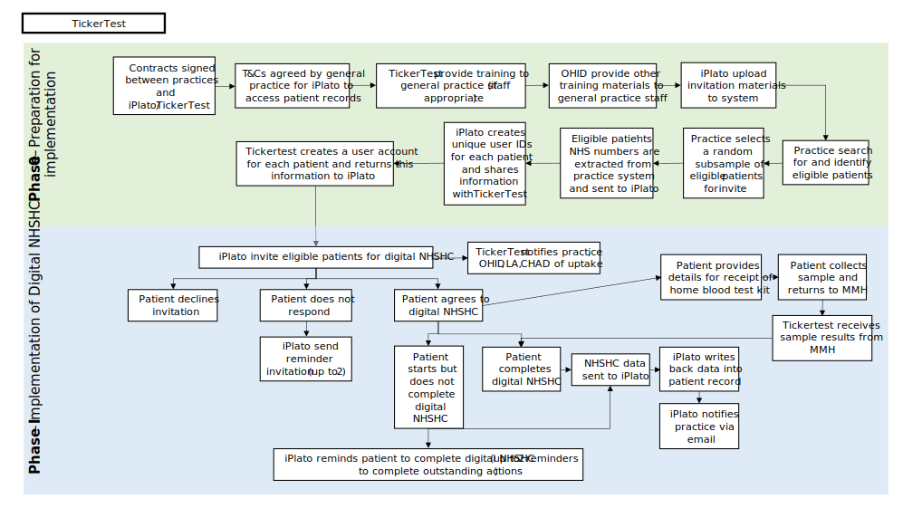

> ⚠️ **Warning**
>  
> **Draft Documents**: May not represent real world scenarios, may not be fully accurate or complete.
>
> Please contact the author for more information.

# Summary
- Uses tickertest
- No detailed technical summary available

# Takeaway
- £50 incentivisation after completion
- 

# Review of Standard Operating Procedure
- Date of document unknown
- Standard Operating Procedure document Ticker Test Finalv2

## SOP Summary - Preparation
1. Data Processing Agreements (DPA) signed between practice and iPlato/TickerTest
2. TickerTest provides training to general practice staff
3. OHID provide other training materials to general practice staff
4. iPlato upload invitation materials to relevant system (if not already done so)
5. Practice searches for and identifies eligible patients
6. Practice selects a random subsample eligible patients for invite 
7. Eligible patients’ NHS numbers are extracted from practice system and sent to iPlato
8. iPlato creates unique user IDs for each patient and shares information with TickerTest
9. TickerTest creates a user account for each patient and returns this information to iPlato

## Key facts
- 3 Surgeries in trial
- 14,857 eligible population 

1.	iPlato invites eligible patients for digital NHS Health Check
2.	TickerTest notifies practice, OHID, LA and Staffordshire University of uptake each week of Phase I
	- If at 2 weeks into the fieldwork uptake of the digital NHS Health Check is significantly lower than anticipated (i.e. 20% of those invited in week 1 have completed the check and 20% of those invited in week 2 have started the check) a conversation will be held with practices to request they send a larger than scheduled batch of invitations in week 3 and potentially extend to week 4. 
	- If at 2 week into the fieldwork uptake of the digital NHS Health Check is significantly higher than anticipated ( i.e. near to 500 checks have been completed) then fewer invitations will need to be sent in the following week(s)  
	- This proposed plan is contingent on the number of cholesterol tests being sent out, this will need to be monitored to ensure that once supplies are depleted no further invites are sent out. The mechanism for HBA1C tests to be sent should be turned on after 50 checks have been completed and off after 100.
	- Practices should record the number of calls they receive from patients relating to the digital NHS Health Check programme and feed back to OHID and Staffordshire University. This can be a simple tally record.
If 500 completed digital NHS Health Checks are not completed in the local authority (during the period of data collection), the local authority representative should consider (with support from OHID and the Staffordshire University team) increasing the number of invitations that are sent by each participating general practice (where possible).

### Invitation outcome:
1.	Patient takes no action following the invitation
	1.	Up to two reminder invitations sent by iPlato 
If the patient does not respond to the invitation, iPlato should send a reminder after one week (see wording at annex B).If the patient does not respond to the first reminder, iPlato should send a second reminder after the first week of sending the first reminder. Only two reminders should be sent to the patient.
	1.	Please note: Patients should remain on the general practice’s eligibility list for an NHS Health Check and be offered this once provision of in-person  NHS Health Checks resume and the surgery has capacity to do so (this offer is separate to the evaluation and may be done after the evaluation has been completed).

1.	Patient agrees to the digital NHS Health Check
	1.	Patient starts but does not complete digital NHS Health Check
This is not limited to but will most likely apply to those who do not complete physiological measures (i.e., blood pressure and cholesterol testing).

	    1.	iPlato reminds patients to complete digital NHS Health Check
If a patient starts but does not complete the digital NHS Health Check, iPlato should send the patient a reminder text after one week of commencing the digital NHS Health Check. If the patient does not complete the digital NHS Health Check after one week of receiving a reminder, iPlato should send a second reminder text. If the patient does not complete the digital NHS Health Check following a second reminder, they should be considered a partial completer and invited to complete the online survey – this should be sent 2 weeks after the final reminder. 
    2.	NHS Health Check data sent to iPlato
The data provided by the patient in the partially completed digital NHS Health Check should be sent to iPlato following confirmation of a partial completion. 
    3.	iPlato writes back data into patient record
The general practice should then be able to review the data. Practices should invite the individual to complete their NHS Health Check in person or alternatively, retain the patient on the eligible patient list and invite them for an in-person NHS Health Check once that service is resumed.
    4.	iPlato notifies practice via email
    1.	Patient provides details for receipt of home blood test kit during completion of digital NHS Health Check
        1.	Patient collects sample and returns to Monitor My Health
Upon retrieval of the home test kit, the patient collects a blood sample and returns the sample to the laboratory. 
        2.	TickerTest receives the results 
        3.	Patient completes digital NHS Health Check
Following completion of the digital NHS Health Check, iPlato should invite the patient to complete the online survey within 24 hours.
        4.	NHS Health Check data sent to iPlato
        5.	iPlato write back data into patient record
        6.	iPlato notifies practice via email 
Practices will be notified of all patients who have completed an NHS Health Check. Patients with high readings will be flagged on the email (annexe C)

## Phase II – Receipt of non-identifiable anonymised data

Phase II refers to all steps that need to be taken to transfer anonymised patient-level data and includes the following (see figure two):
1.	iPlato creates anonymised patient-level dataset for:
    1.	All those who were invited to complete the digital NHS Health Check
The Staffordshire University team will create an excel template that specifies the format but should include the following fields:
        1.	Age 
        1.	Sex
        1.	Ethnicity
        1.	Lower Super Output Area (LSAO) (a non-patient identifiable geographical code that allows derivation of deprivation)
        1.	Cardiovascular disease risk (%10-year risk score in the form of QRISK, if available)
        1.	Response: 
            1.	Do not respond or decline invitation 
            2.	Decline digital and request face-to-face NHSHC
            3.	Accept digital NHSHC
        1.	Uptake (for those who accept)
            1.	Did not engage with the digital NHSHC
            2.	Started the digital NHSHC, but did not complete
            3.	Completion – which sections of the NHSHC were completed/not completed.
    1.	All those who were invited and started the digital NHS Health Check The data should include the above fields, in addition to:
        1.	Smoking status
        1.	Height (m), weight (kg), and Body Mass Index (BMI, kg/m2)
        1.	Total Cholesterol
        1.	HDL Cholesterol Ratio
        1.	Blood pressure (systolic and diastolic, mmHg)
        1.	Cardiovascular disease risk (%10-year risk score in the form of QRISK)
        1.	Diabetes risk score
        1.	Alcohol consumption (based on AUDIT score)
        1.	Physical activity level (based on the GP Physical Activity Questionnaire)
2.	Anonymised patient-level dataset sent to Staffordshire University via secure transfer 
The anonymised patient-level dataset should be sent to the Staffordshire University team via agreed secure data transfer process. The dataset should be sent to the Staffordshire University team every 3 weeks for monitoring purposes. The final dataset should be sent one week following completion of infield testing. 
3.	Staffordshire University team analyse data

## Phase III – Surveys and interviews

Phase III refers to all steps that need to be taken to complete the evaluation phase of the project and includes the following (see figure two):
1.	iPlato/TickerTest send a link to patients to complete the online survey hosted by Staffordshire University (all those who started and completed the digital NHSHC AND those who did not respond to the digital NHS Health Check invitation) (Annexe D)
For those who did not respond to the invitation or who started but did not complete the digital NHS Health Check, the online survey invitation should be sent two weeks following the second (and last) reminder to complete the digital NHS Health Check. For those who complete the digital NHS Health Check, the online survey invitation should be sent within 24 hours of completing the digital NHS Health Check. Please note: there are two separate surveys for those who respond and do not respond to the digital NHS Health Check invitation. Please ensure the correct URL link is used.
a.	iPlato/TickerTest send two reminder invitations to patients to complete the digital NHS Health Check (Annexe D)
A reminder invitation to complete the online survey should be sent one week and two weeks after the first invitation. As it cannot be determined which patients have completed the online survey, all patients who started but did not complete or completed the digital NHS Health Check should receive a reminder invitation. 
2.	Invitation outcome:
a.	Patient does not complete the online survey
b.	Patient completes the online survey (responders and non-responders)
i.	Survey respondent provides contact details to express interest in an interview at the end of the survey (responders and non-responders)
ii.	Staffordshire University invite participant for interview (responders and non-responders)
The Staffordshire University team will invite the survey respondent within four weeks of completing the online survey. 
iii.	Staffordshire University obtains consent and conducts interview with patient (responders and non-responders)
iv.	Interview is sent for transcription
v.	Interview is analysed 

3.	Within one month of commencing Phase I, the local authority representative will email invitations for interview to commissioners and health care providers
4.	Invitation outcome:
a.	Participant declines invitation
b.	Participant does not respond to invitation
i.	Local authority representative sends up to two reminder invitations
A reminder invitation should be sent one week- and two weeks- following the first invitation.
c.	Participant expresses interest in the interview
i.	Staffordshire University obtains consent and conducts interview with participant
ii.	Interview is sent for transcription
iii.	Interview is analysed 

## Blood pressure parameters for use in Tickertest, including notification messaging for users
| If taken at home                                                                                             | If taken elsewhere eg, GP Practice, pharmacy, or hospital.                                                   |
| ------------------------------------------------------------------------------------------------------------ | ------------------------------------------------------------------------------------------------------------ |
| Low blood pressure readings                                                                                  | Low blood pressure readings                                                                                  |
| Systolic: lower than 85 mmHg                                                                                 | Systolic: lower than 90 mmHg                                                                                 |
| Diastolic: lower than 55 mmHg                                                                                | Diastolic: lower than 60 mmHg                                                                                |
| Call your GP practice to make a routine appointment for BP check.                                            | Call your GP practice to make a routine appointment for BP check.                                            |
|                                                                                                              |                                                                                                              |
| Normal blood pressure readings                                                                               | Normal blood pressure readings                                                                               |
| Systolic: more than 85mmHg and below 135 mmHg                                                                | Systolic: more than 90mmHg and below 140 mmHg                                                                |
| Diastolic: more than 55mmHg and below 85 mmHg                                                                | Diastolic: more than 60mmHg and below 90 mmHg                                                                |
|                                                                                                              |                                                                                                              |
| High blood pressure readings and possible hypertension                                                       | High blood pressure readings and possible hypertension                                                       |
| Systolic: between 135 and 175 mmHg                                                                           | Systolic: between 140 and 180 mmHg                                                                           |
| Diastolic: between 85 and 115 mmHg                                                                           | Diastolic: between 90 and 120 mmHg                                                                           |
| Call your GP practice to make a routine appointment for BP check or assessment of hypertension.              | Call your GP practice to make a routine appointment for BP check or assessment of hypertension.              |
| Very high blood pressure readings and definite hypertension                                                  | Very high blood pressure readings and definite hypertension                                                  |
| Systolic: higher than 175 mmHg                                                                               | Systolic: higher than 180 mmHg                                                                               |
| Diastolic: higher than 115 mmHg                                                                              | Diastolic: higher than 120 mmHg                                                                              |
| Call your practice the same day as readings (or 111 if practice is closed), they will advise you what to do. | Call your practice the same day as readings (or 111 if practice is closed), they will advise you what to do. |

## Annex D: Survey SMS invitations and reminders

### Responders 
#### Initial invitation text message
You have completed your online NHS Health Check. To help improve the service, you are invited to share your views on the experience by completing a short survey. After completing the survey, you can be you can be entered into a prize draw to win one of ten £50 retail vouchers. To complete the survey or find out more about it, please click the following link: https://staffordshire.qualtrics.com/jfe/form/SV_3CTKiUFcATwhYYm This is the first of three invitations.

#### Reminder invitation text message
You have completed your online NHS Health Check. If you have already shared your views about the check, please ignore this reminder. If you have not yet done so, please complete a short survey to help us understand more about your experience. After completing the survey, you can be entered into a prize draw to win one of ten £50 retail vouchers. For more information about the survey please click the following link: https://staffordshire.qualtrics.com/jfe/form/SV_3CTKiUFcATwhYYm 

### Non-responder invitation 
#### Initial invitation text message
You have chosen not to take up the offer of an online NHS Health Check and we are keen to understand why through a short survey. If you complete this online survey, you will receive a £5 retail voucher. To complete the survey or find out more about it, please click the following link: https://staffordshire.qualtrics.com/jfe/form/SV_9MDUPTiL13C6wxo .This is the first of three invitations.

#### Reminder invitation text message
You have chosen not to take up the offer of an online NHS Health Check and we are keen to understand why. If you have already shared your views about the check, please ignore this reminder. If you have not already completed this online survey, you will receive a £5 retail voucher for doing so. For more information about the survey please click the following link: https://staffordshire.qualtrics.com/jfe/form/SV_9MDUPTiL13C6wxo
