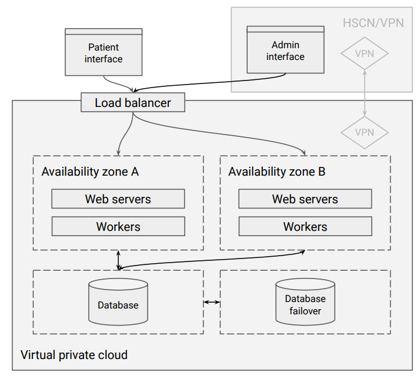
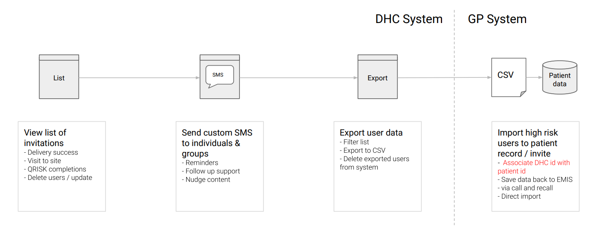
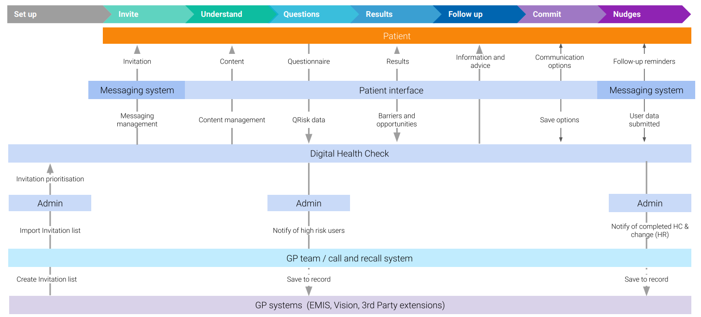
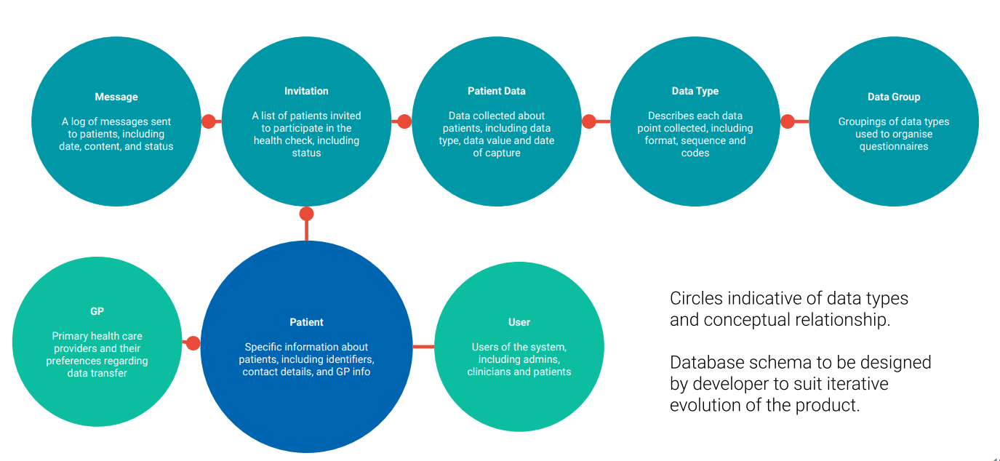

> ⚠️ **Warning**
>  
> **Draft Documents**: May not represent real world scenarios, may not be fully accurate or complete.
>
> Please contact the author for more information.

# Summary

- Document source "GMHSC Health Check Alpha Report and Beta plan Anon.pdf"
- Dated 11 March 2020
- V Large document 200+ pages
- Technical Architecture from page 175 - 192

# Takeaways
- Email to GP as an option
- Mgmnt bulk download as a GP integration option

### DHC Cloud Architecture
- Load balancer - Single point of entry for user requests. 
Only listens to encrypted HTTPS connections and 
forwards requests to the Web servers that sit inside 
the private network, isolated from the internet
- Gateway - Single point of entry for sysadmins. Only 
listens to SSH connections coming from the known 
private networks
- Web servers - Provide a web interface for patients to 
fill-in questionnaires and see advice. Clinician access, 
if required, is manually given by sysadmins and 
controlled by username and password. Patient access 
is yet to be determined
- Worker - Runs background tasks such as sending and 
receiving SMS messages
- Database - Stores all data for the application. Only 
listens from connections coming from inside the 
application’s virtual private network

## Assumptions for admin workflow in (early) beta 

### Outbound invitations
1. The simplest way to invite users to perform a DHC is to via a list in CSV 
format exported from a GP system (call & recall or EMIS etc).
2. The system will be capable of consuming this CSV and converting it to a 
viable dataset.
3. The system should be capable of converting a suitable (eg. NHS Number) 
unique ID (along with GP ID) from patient record into a unique ID to be used 
by the DHC system.
4. Personal data in the DHC system should be kept to a minimum during beta 
and where possible should be deleted.
5. Visibility of personally identifiable data should be kept to a minimum while 
using the backend interface

### Inbound results and QRISK completion data
1. GP users should only see their own invitations and results.
2. DHC users can see the status of all invitations and status.
3. GP and DHC users can send custom SMS messages to a user and it should 
be saved in the in the backend as a history (and as a means of learning).
4. DHC is capable of exporting CSV lists of users who have completed the 
QRISK and their associated data in order that is can be uploaded to a GP 
system.
5. The GP system should be able to read this data and add it to a patient 
record (with provenance attached).
6. The GP system or DHC should be able to associate the data with the original 
user (unique ID) so that it knows who filled in the QRISK (which patient and 
GP)

There are three potential scenarios for identifying patients as they complete the digital health 
check:
- Anonymous - (Not part of the initial Beta plan) Patients may visit the DHC website with no 
invitation from a GP but via an internet search or recommendation. In this scenario, they would 
need to identify themselves and their GP in order for the system to direct them into the GP’s 
care should they be high risk.
- Identified - Patients use a personal link (token) that has been sent to them via an invitation. 
This link allows the DHC system to send data back to the correct GP and for the information to 
be incorporated back into GP patient record.
- Verified - As with identified, but with an additional step for patients to provide personal 
information to verify that they are the intended recipient of the invitation. Whilst reducing the 
small risk of the wrong patient completing the health check, this will create an additional 
barrier to use and increase the amount of personal data being passed between systems

## Anonymous, identified and verified users
For beta, we want to invite specific users, so anonymous users are not top 
priority at this stage of development.
Patient data APIs - 
NHS Login
NHS number
1 time limited use Tokens

## Notifying GPs of change
System overview
GPs will need to be notified when a patient is identified as having a high QRisk
score. A number of options should be considered:
- Emailed report
- Structured data
- API integration
- Management interface

### Longer term technical considerations

A wide variety of standards, frameworks and
systems have been considered in the alpha
research to accomplish the objective of defining
the fastest route to developing an online digital
health check.
The following list should be considered and
consulted regarding readiness and feasibility
alongside the needs and policies of a suitable
host organisation.
The beta plan aims to provide the fastest route
to validation of a DHC and as a result has not
focussed on wider health system strategies.

- Medical device regulations
  - DHC needs to further defined in
beta
- NHS app library assessment
  - Suitability to open the DHC to the
public more widely
- LHCRE – Greater Manchester care record
  - Test readiness and integration
options once beta has evidence
- NHS app
  - Delivering DHC through NHS app
- NICE Evidence Standards Framework for
Digital Health Technologies
  - Longer term assessment and
validation of the DHC impact

## Guide technical specifications for development 
Host organisations and developers will have specific 
approaches and policies toward the following but any 
service should comply with best practices including: 
- A suitable cloud based hosting infrastructure 
(AWS/Heroku)
- Automatic scaling for increasing users in later 
phases
  - Adequate security
  - Strong passwords
  - HTTPS/SSL
  - Secure file permissions & ownership
  - Data management in line with data 
governance risk stratification guidelines
- Use suitable code repositories and deployment 
systems (eg. github, docker)
It’s proposed that the beta use the most suitable 
components services & platforms 
- Notify (SMS, email, letters)
- Health & Social Care Network
- Analytics (Google)
- AWS/AZURE
- CMS (not required in phase 1 beta)
Development process should adhere to standards and 
good practice where applicable
- Automated code deployment and testing
- Product management, sprints and feature 
prioritisation
- Production and staging environments
- Frequent & incremental deployment of new 
features

## Decisions to be resolved in beta 
- Access to read / write on EMIS/Vision patient 
records needs to be considered with NHS Digital
  - Diabetes My Way in GM should be 
consulted further on this to understand 
their experience
- FHIR & OpenEHR - use in beta will have 
dependencies on host organisations and policies
- Consult with Chris Chapman - Salford 
Royal Digital Exemplar
- Initial consultation has been completed with Call & 
Recall providers (Informatica & Health 
Diagnostics) continued discussions need to take 
place:
  - Importing and exporting of data to DHC 
system
- Re-importing data into GP systems and 
into patient record if appropriate
  - Associating DHC results with patient data 
in GP systems
- How do GP’s want information to integrate into 
their workflow?
  - Further consultation with GPs needed
- Secondary data policy and analytics to be 
considered by hosting organisation in 
consultation by GMHSC policy leads
- Patient data storage on a beta system needs to be 
in line with NHS information governance Risk 
Stratification 
https://www.england.nhs.uk/ig/risk-stratification/
specifically:
  - Receipt of data;
  - Retention period; 
  - Role based access controls, authorisation 
and maintenance;
  - Induction and training processes for 
users; 
  - How audit trails will be maintained and 
confidentiality audits may be undertaken