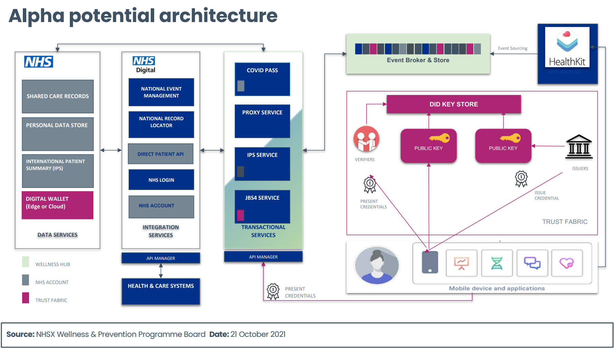

> ⚠️ **Warning**
>  
> **Draft Documents**: May not represent real world scenarios, may not be fully accurate or complete.
>
> Please contact the author for more information.

# Summary
- Not a dedicated DHC programme, however, the style and flow of the wellness and prevention programme is similar to what is required for a DHC.
- 2 Workstreams - Front end app and back end architecture
# Takeaways
- Alpha of a UI for data collection
- Alpha of event sourcing style backend

[Apha Report](../../wellness-prevention/wellness-alpha-report_v1.pdf)

- The revised scope for Workstream 2 was to build the core software and infrastructure 
components, enabling a technology platform on which Front-End applications and third-party 
systems (TPS) could securely access wellness and prevention capabilities.
- Access to the platform will be via open and secure interfaces, that are deployed and hosted on 
highly available and scalable public cloud infrastructure.
- Centralized information is a key resource and data assets are collected and curated from 
multiple sources and stored securely on durable storage devices to prevent data loss. Data 
sharing and other policies and controls prevent unauthorized access to an individual’s data 
record. 
- System interoperability is a key requirement of the Wellness platform in order that computer 
systems, both internal and external can connect, communicate and share data within the 
wider digital service ecosystem. 
- Core platform services (sometimes referred to as backbone services) are not user/patient 
facing, operating ‘below the waterline’, analogous to an iceberg (see later slide).

### Platform capabilities
- Core platform capabilities describe what the underlying services do (as opposed to how) in 
order to realize the strategic outcomes and deliver real value to end users. 
- The service platform is designed to enable the critical business services that are relevant to the 
promotion of patient wellness, prevention of ill health and reducing health inequality.
- Priority platform capabilities for the Alpha release include:
- Core platform services (application, infrastructure and integration)
- NHS App & NHS Login integrations
- Wearable device integration 
- Several system integrations, originally scheduled for Alpha have been descoped due to 
limitations being discovered in system dependencies. 
- The following slides show the platform capability map and high-level descriptions of work 
completed as part of the Alpha development for each of the capability areas

### Core platform build: Summary
#### What we did:
- Engineered a solution design based around the principles of event driven architecture and 
event sourced systems.
- Developed core backbone services for the event store and the supporting cloud infrastructure 
and technology components. 
- Incorporated various support tools for managing the build lifecycle and developed scripts for 
automating software deployment and the provisioning of cloud resources.
- Integrated several National Digital Services and third-party systems using open standards 
policies and approved integration patterns.
- Automated unit testing for components so high-quality assurance levels can be guaranteed as 
new features are developed and deployed. 
- Authored detailed content for each of the design, development and technology domains that 
contains the ‘what’ and the ‘how’.
#### What we learnt:
- During Alpha, several limitations with EventStoreDB (database preferred in Discovery) were 
surfaced including concerns around maintainability of infrastructure prompting further analysis 
of the recommended database technology stack for Beta in favour of a more generic Platformas-a-Service (PaaS) based solution.

### NHS App: Summary
#### What we did:
- Connected both the NHS App and Wellness service using the standard silver 
integration pattern.
- Extended the Wellness authorisation service to support user single sign on (SSO) 
and prevent the need for users to log in multiple times in order to access digital 
services.
- Configured the Wellness front-end components to support feature-toggling and 
the showing and hiding of content when accessing through different channels. 
#### What we learnt:
- Technical spikes concluded that there would need to be changes made to the 
NHS App Information Architecture (IA) in order to support some of the features 
required by the Wellness service

### NHS Login: Summary
#### What we did:
- Developed the components required to request and process authorisation codes 
from the NHS authorisation code API.
- Developed the components required to request and process access tokens from 
the NHS generate token API.
- Developed the components required to request and process user information 
claims from the NHS user details API.
- Proved connectivity between the two systems in the sandpit environment and 
demonstrated this by completing several end-to-end user journeys depending 
on the use-case (a valid user; an invalid user, exception management etc). 
#### What we learnt:
- The NHS Login identity service exposes a mature endpoint and well-defined 
interface for implicit and explicit identity and authorization management, which 
simplified the integration with Wellness. This code is reusable for future phases of 
work

### Health wearable / devices: Summary

#### What we did:
- Developed the integration components required to sync data collected on an iOS 
device with the Wellness service using the Apple HealthKit software development 
kit (SDK). Integrating systems using the SDK is necessary as there is no public 
facing API that can be used to access the raw data (activity, observables, sleep 
etc.) 
- Developed a proof-of-concept mobile App that can retrieve processed data 
stored in the Wellness service and then render onto a user’s mobile device. The 
mobile app demonstrates the end-to-end user journey from data collection, 
synchronisation, processing and presenting back to the user in a variety of 
formats i.e., graphs, tables etc.
- Tech spike commissioned to develop a basic Information Governance (IG) 
component that asked the user to provide consent around data sharing, data 
processing etc. This was a tactical component needed to enable the integration 
and will be discontinued for the Beta application. 

#### What we learnt:
- This exercise confirmed connectivity between the Wellness service and a wearable 
iOS device could be established, and data exchanged bi-directionally. The team 
also identified the data types and format of information provided by the device 
and implemented functions to map wearable data to the Wellness domain data

### Platform outcomes
- The platform team have been able to de-risk technology assumptions by engaging domain 
architects to design and build software components that resolve real-world business problems.
- Alpha has provided the opportunity to test different technology stacks and frameworks that 
‘best fit’ the Wellness and Prevention product definition and ensure that any solution taken 
forward is maintainable and meets sustainability guidelines.
- The output from this workstream is a collection of interoperable applications and technology 
services on which future business services can be hosted.