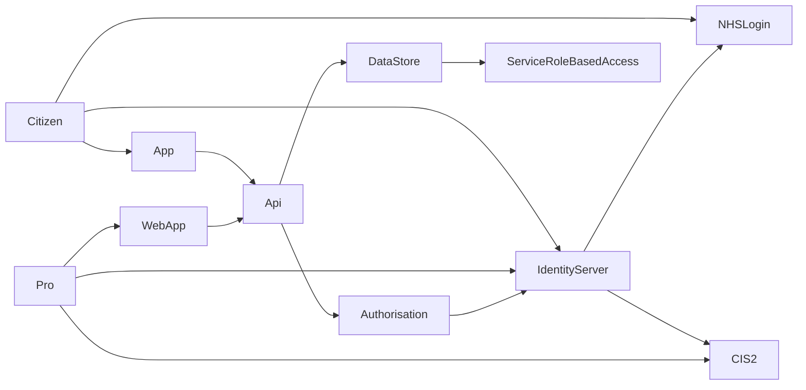

> ⚠️ **Warning**
>  
> **Draft Documents**: May not represent real world scenarios, may not be fully accurate or complete.
>
> Please contact the author for more information.

# Pull not Push - NHS Login / CIS2 OpenId

# Temp Notes
- Identity 
  - CIS2 Login
  - NHS Login
- Azure B2C
  - custom policies
  - key conversion
- Identity Server 4
- Authorisation
- OpenId
- Scopes / claims

$ \int\_a^b f(x)\,dx. $

# Review Paper - NHS Identity Providers and Authorization
## Abstract
- provide short summary. 

## Summary
- If it is hard to push structured data in to GP Systems, then provide a way to allow GPs to pull the data.
- Whats been done in the past / now?
- Questions to be asked?
  - id server with multiple id providers
  - auth 
  - would it be useful?

### Aims
- Proof of concept investigations into using an existing Authorisation platform with two NHS Identity providers, NHS Login and CIS2.

### Why is needed?
- To Architect solutions for Alpha / Beta / Production, there are standards that shouldn't need to be revisited each time. 
- Separate review into these can be reused

### Other possible outcomes / benefits 
- NHS app review / targets - a want for adoption of NHS App & Login to increase
  - Makes sure its easy for third parties / suppliers to integrate

> ***What should summary contain*** [^what-in-summary]
> 
> *The introduction provides the background information necessary to understand why the described experiment was conducted.  The introduction should describe previous research on the topic that has led to the unanswered questions being addressed by the experiment and should cite important previous papers that form the background for the experiment.  The introduction should also state in an organized fashion the goals of the research, i.e. the particular, specific questions that will be tested in the experiments.  There should be a one-to-one correspondence between questions raised in the introduction and points discussed in the conclusion section of the paper.  In other words, do not raise questions in the introduction unless you are going to have some kind of answer to the question that you intend to discuss at the end of the paper.*
> 
> *You may have been told that every paper must have a hypothesis that can be clearly stated.  That is often true, but not always.  If your experiment involves a manipulation which tests a specific hypothesis, then you should clearly state that hypothesis.  On the other hand, if your experiment was primarily exploratory, descriptive, or measurative, then you probably did not have an a priori hypothesis, so don't pretend that you did and make one up.  (See the discussion in the introduction to Experiment 4 for more on this.)  If you state a hypothesis in the introduction, it should be a general hypothesis and not a null or alternative hypothesis for a statistical test.  If it is necessary to explain how a statistical test will help you evaluate your general hypothesis, explain that in the methods section.* 
> 
> *A good introduction should be fairly heavy with citations.  This indicates to the reader that the authors are informed about previous work on the topic and are not working in a vacuum.  Citations also provide jumping-off points to allow the reader to explore other tangents to the subject that are not directly addressed in the paper.  If the paper supports or refutes previous work, readers can look up the citations and make a comparison for themselves.*
> 
> *Do not get lost in reviewing background information. Remember that the Introduction is meant to introduce the reader to your research, not summarize and evaluate all past literature on the subject (which is the purpose of a review paper). Many of the other studies you may be tempted to discuss in your Introduction are better saved for the Discussion, where they become a powerful tool for comparing and interpreting your results. Include only enough background information to allow your reader to understand why you are asking the questions you are and why your hyptheses are reasonable ones. Often, a brief explanation of the theory involved is sufficient.*
> 
> *Write this section in the past or present tense, never in the future. " (Steingraber et al. 1985)*

## Hypothesis
If a system is available and there is an easy enough way for GPs to access Digital Health Check data, then it will be used by GPs who choose to access their patients Digital Health Check results.

- Dependant Variable: GP's usage of system
- Independent variable: Method of access to system

## Methods
This research looks at using two identity providers, NHS Login and CIS 2, with two different Authorisation providers - Azure B2C and IdentityServer4.

### What is NHS Login?
NHS Login is an OpenId identity provider for Citizens to use. It has 3 levels of identity proof, P0, P5 and P9 [^nhs-login-trust-vectors].

| Level                                      | Description                                                                |
| ------------------------------------------ | -------------------------------------------------------------------------- |
| **Low (P0)**  Low identity proofing        | A user has verified ownership of an email address and mobile phone number. |
| **Medium (P5)** Basic identity information | The user has provided some information that has been checked to correspond to a record on PDS. This maps to ‘Verification – Medium’ within DCB3051|
|**High (P9)** Physical comparison	|The user has completed an online or offline identity verification process where physical comparison between the photographic identity and the person asserting their identity has occurred. This maps to ‘Verification – High’ within DCB3051|

### Client Secret, Token Signing & Key Size
NHS Login **does not support the use of a client secret** for client authentication.

### NHS Login
### CIS2 
### Azure B2C
#### NHS Login

##### Custom Profile 

#### CIS2

### Identity Server 4
#### NHS Login
#### CIS2

## Results

## Conclusion

## Evaluation

## References

[^what-in-summary]: Components of a scientific paper

    - Reference: [Components of a scientific paper][what-in-summary]
    - Type: Website
    - Last Checked: 15/07/2022

[^nhs-login-trust-vectors]: Introduction to Vectors of Trust
    - Reference: [Introduction to Vectors of Trust][nhs-login-trust-vectors]
    - Type: Website
    - Last Checked: 18/07/2022

[what-in-summary]: https://researchguides.library.vanderbilt.edu/c.php?g=69346&p=831743 "BSCI 1510L Literature and Stats Guide: 3.2 Components of a scientific paper"
[nhs-login-trust-vectors]: https://nhsconnect.github.io/nhslogin/vectors-of-trust/ "Introduction to Vectors of Trust"