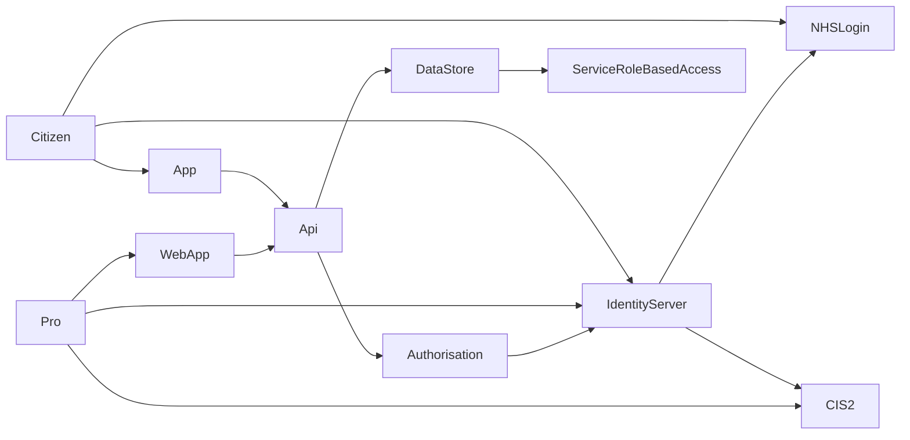

> ⚠️ **Warning**
>  
> **Draft Documents**: May not represent real world scenarios, may not be fully accurate or complete.
>
> Please contact the author for more information.


# Pull not Push - NHS Login / CIS2 OpenId

# Temp Notes
- Identity 
  - CIS2 Login
  - NHS Login
- Azure B2C
  - custom policies
  - key conversion
- Identity Server 4
- Authorisation
- OpenId
- Scopes / claims

# Review Paper - NHS Identity Providers and Authorization
## Abstract
- provide short summary. 

## Summary
- If it is hard to push structured data in to GP Systems, then provide a way to allow GPs to pull the data.
- Whats been done in the past / now?
- Questions to be asked?
  - id server with multiple id providers
  - auth 
  - would it be useful?

Any system would need an authorisation platform, and should use existing identity providers. Initial research indicated that both NHS Login and CIS2 may have long signup processes that would need to be started early to ensure they are ready for an Alpha or Beta stages.

Concerns over how to implement authorisation and Identity **should not need to be** part of any Alpha or Beta (or production) project, it should, be "ready out of the box". However, there are limited available resources that provide an authorisation server with full configuration for both NHS Login and CIS2 as an identity provider. This research should be able to be used not only for digital health check, but all other projects requiring identity and authorisation for both citizens and health professionals.


### Aims
- Proof of concept investigations into using an existing Authorisation platform with two NHS Identity providers, NHS Login and CIS2.

### Why is needed?
- To Architect solutions for Alpha / Beta / Production, there are standards that shouldn't need to be revisited each time. 
- Separate review into these can be reused

### Other possible outcomes / benefits 
- NHS app review / targets - a want for adoption of NHS App & Login to increase
  - Makes sure its easy for third parties / suppliers to integrate

### Components Integration

*User/System Data components integration & flow diagram*


## Hypothesis
If a system is available and there is an easy enough way for GPs to access Digital Health Check data, then it will be used by GPs who choose to access their patients Digital Health Check results.

- Dependant Variable: GP's usage of system
- Independent variable: Method of access to system

## Methods
This research looks at using two identity providers, NHS Login and CIS 2, with two different Authorisation providers - Azure B2C and IdentityServer4.

### NHS Login
NHS Login is an OpenId identity provider for Citizens to use. It has 3 levels of identity proof, P0, P5 and P9 [^nhs-login-trust-vectors].

| Level                                      | Description                                                                                                                                                                                                                                   |
| ------------------------------------------ | --------------------------------------------------------------------------------------------------------------------------------------------------------------------------------------------------------------------------------------------- |
| **Low (P0)**  Low identity proofing        | A user has verified ownership of an email address and mobile phone number.                                                                                                                                                                    |
| **Medium (P5)** Basic identity information | The user has provided some information that has been checked to correspond to a record on PDS. This maps to ‘Verification – Medium’ within DCB3051                                                                                            |
| **High (P9)** Physical comparison          | The user has completed an online or offline identity verification process where physical comparison between the photographic identity and the person asserting their identity has occurred. This maps to ‘Verification – High’ within DCB3051 |

### Applying for access to NHS Login
**It is not a quick process** to integrate NHS Login with a product. It Takes 3 - 4 months to fully integrate into a live environment.

 
*NHS Login onboarding process [^nhs-login-onboarding]*

[The application form (Excel document) can be found here](https://digital.nhs.uk/binaries/content/assets/website-assets/services/nhs-login/nhs-login-application-form-v0.4-20211130.xlsx) which should be send to (engage.nhslogin@nhs.net)[mailto:engage.nhslogin@nhs.net].

The current restrictions are:
- serve patients that are registered at a GP practice in England, and/or are receiving NHS services in England
- be patient facing
- offer a health or social care benefit
- be commissioned (contracted) or sponsored in development by an NHS organsiation (such as a CCG, ICS or General Practice) or Local Authority.
- be free to the patient at the point of delivery (excluding any NHS levied charges such as prescription charges)

This research utilised the already started, but not used, NHS Login application for NHS Wellness and Prevention. This allowed stage 1, apply, to be skipped.

### Developing in the NHS Login Sandpit


Pre requisites:
- generate RSA 512 public/private key pair
  
Needed for submission to NHSLogin:
- Public key for the private key
- Required scopes

Provided by NHSLogin:
- Client ID

### Client Secret, Token (JWT) Signing & Key Size
NHS Login **does not support the use of a client secret** for client authentication. Instead calls to the token endpoint requires the private_key_jwt method [^private-key-jwt].

The key must be in RSA512 format. Note, many authorisation providers that support JWT signing default to expecting RSA256 key size.


> | Attribute                   | Required | Description                                                                                                                                  |
> | --------------------------- | -------- | -------------------------------------------------------------------------------------------------------------------------------------------- |
> | **token_signing_algorithm** | No       | Specifies the signing algorithm to use when token_endpoint_auth_method is set to private_key_jwt. Possible values: **RS256 (default)** or RS512. |
> 
> *Azure AD B2C custom policy - Token endpoint metadata* [^azure-b2c-token-endpoint]


> ### ℹ Guidance for generating asymmetric key pair
> You will need to provide a public key when registering for the service. This is required for the authentication mechanism on the token endpoint. The steps below explain how to generate that public key and corresponding private key.
> 
> Full details can be found [here](https://en.wikibooks.org/wiki/Cryptography/Generate_a_keypair_using_OpenSSL).
> 
> **Generate private_key.pem**
> 
> ``` openssl genpkey -algorithm RSA -out private_key.pem -pkeyopt rsa_keygen_bits:2048 ```
> 
> **Generate corresponding public_key.pem**
> 
> ``` openssl rsa -pubout -in private_key.pem -out public_key.pem ```
> 
> You should now have your key pair. Only send the contents of the public_key.pem file when requesting access to a new environment.
> 
> *Generating NHS Login PEM* [^gen-pem]


### Managing Signed JWT in C#
Once a PEM has been generated, this can be used in C# to sign the token. The following sections are excerpts from the **nhs-login-client sample project**.


[View it on GitHub]({{ site.gh_edit_repository }}/{{ site.gh_edit_view_mode }}/{{ site.gh_edit_branch }}/samples/nhs-login-client){: .btn .fs-5 .mb-4 .mb-md-0 }

This project is a rewaorked dotnet 6 sample project, using all in built dotnet libraries where possible.

[View it on GitHub]({{ site.gh_edit_repository }}/{{ site.gh_edit_view_mode }}/{{ site.gh_edit_branch }}/samples/nhs-login-client/Client){: .btn .fs-5 .mb-4 .mb-md-0 }

<script src="https://gist.github.com/RossBugginsNHS/88bb46720c52456590ecfe77eae5307d.js"></script>

### Using TokenHelper
[View it on GitHub]({{ site.gh_edit_repository }}/{{ site.gh_edit_view_mode }}/{{ site.gh_edit_branch }}/samples/nhs-login-client/Client){: .btn .fs-5 .mb-4 .mb-md-0 }
<script src="https://gist.github.com/RossBugginsNHS/e4559f15cb66a2fa7503f9e554b6aee7.js"></script>

### Using NHSLoginOpenId Extension Method
[View it on GitHub]({{ site.gh_edit_repository }}/{{ site.gh_edit_view_mode }}/{{ site.gh_edit_branch }}/samples/nhs-login-client/Client){: .btn .fs-5 .mb-4 .mb-md-0 }
<script src="https://gist.github.com/RossBugginsNHS/2153cf67afd6a5decfaf7a479ef70010.js"></script>

### Using AddNHSLogin
[View it on GitHub]({{ site.gh_edit_repository }}/{{ site.gh_edit_view_mode }}/{{ site.gh_edit_branch }}/samples/nhs-login-client){: .btn .fs-5 .mb-4 .mb-md-0 }
<script src="https://gist.github.com/RossBugginsNHS/29bc731ccf78dbcce3ba98ee9039da56.js"></script>

## CIS2 

[View it on GitHub]({{ site.gh_edit_repository }}/{{ site.gh_edit_view_mode }}/{{ site.gh_edit_branch }}/samples/cis2-login-client){: .btn .fs-5 .mb-4 .mb-md-0 }

Desktop Identity Client for smart cards
https://www.dropbox.com/sh/uf8vw706zd9geae/AACVrTwZrbni324QbXyXORHJa?dl=0

## Azure B2C


##### Custom Profile 
<script src="https://gist.github.com/RossBugginsNHS/e7af078259395f92753706bbe6a820ef.js"></script>

#### CIS2


### Identity Server 4
#### NHS Login
#### CIS2

## Results

## Conclusion

## Evaluation

## References

[^what-in-summary]:Components of a scientific paper

    - Reference: [Components of a scientific paper][what-in-summary]
    - Type: Website
    - Last Checked: 15/07/2022

[^nhs-login-trust-vectors]:Introduction to Vectors of Trust
    - Reference: [Introduction to Vectors of Trust][nhs-login-trust-vectors]
    - Type: Website
    - Last Checked: 18/07/2022

[^private-key-jwt]:OpenId Client Authentication
    - Reference: [OpenId Client Authentication][private-key-jwt]
    - Type: Website
    - Last Checked: 18/07/2022

[^azure-b2c-token-endpoint]:Token endpoint metadata
    - Reference: [Define an OAuth2 technical profile in an Azure Active Directory B2C custom policy - Token endpoint metadata][azure-b2c-token-endpoint]
    - Type: Website
    - Last Checked: 18/07/2022

[^gen-pem]:Generating NHS Login PEM
    - Reference: [Generating NHS Login PEM][gen-pem]
    - Type: Website
    - Last Checked: 18/07/2022

[^nhs-login-onboarding]:NHS Login Onboarding Process
    - Reference: [The NHS login integration process][nhs-login-onboarding]
    - Type: Website
    - Last Checked: 18/07/2022


[what-in-summary]:https://researchguides.library.vanderbilt.edu/c.php?g=69346&p=831743 "BSCI 1510L Literature and Stats Guide: 3.2 Components of a scientific paper"

[nhs-login-trust-vectors]:https://nhsconnect.github.io/nhslogin/vectors-of-trust/ "Introduction to Vectors of Trust"

[private-key-jwt]:https://openid.net/specs/openid-connect-core-1_0.html#ClientAuthentication "OpenId Client Authentication"

[azure-b2c-token-endpoint]:https://docs.microsoft.com/en-us/azure/active-directory-b2c/oauth2-technical-profile#token-endpoint-metadata "Define an OAuth2 technical profile in an Azure Active Directory B2C custom policy - Token endpoint metadata"

[gen-pem]:https://nhsconnect.github.io/nhslogin/generating-pem/ "Generating NHS Login PEM"

[nhs-login-onboarding]:https://nhsconnect.github.io/nhslogin/integration-process/ "NHS Login Onboarding Process"