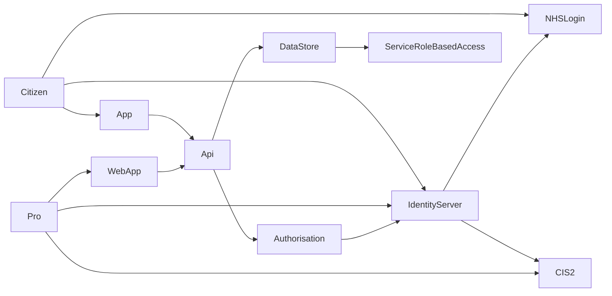

> ⚠️ **Warning**
>  
> **Draft Documents**: May not represent real world scenarios, may not be fully accurate or complete.
>
> Please contact the author for more information.


# Pull not Push - NHS Login / CIS2 OpenId

# Temp Notes
- Identity 
  - CIS2 Login
  - NHS Login
- Azure B2C
  - custom policies
  - key conversion
- Identity Server 4
- Authorisation
- OpenId
- Scopes / claims

$ \int\_a^b f(x)\,dx. $



# Review Paper - NHS Identity Providers and Authorization
## Abstract
- provide short summary. 

## Summary
- If it is hard to push structured data in to GP Systems, then provide a way to allow GPs to pull the data.
- Whats been done in the past / now?
- Questions to be asked?
  - id server with multiple id providers
  - auth 
  - would it be useful?

### Aims
- Proof of concept investigations into using an existing Authorisation platform with two NHS Identity providers, NHS Login and CIS2.

### Why is needed?
- To Architect solutions for Alpha / Beta / Production, there are standards that shouldn't need to be revisited each time. 
- Separate review into these can be reused

### Other possible outcomes / benefits 
- NHS app review / targets - a want for adoption of NHS App & Login to increase
  - Makes sure its easy for third parties / suppliers to integrate

> ***What should summary contain*** [^what-in-summary]
> 
> *The introduction provides the background information necessary to understand why the described experiment was conducted.  The introduction should describe previous research on the topic that has led to the unanswered questions being addressed by the experiment and should cite important previous papers that form the background for the experiment.  The introduction should also state in an organized fashion the goals of the research, i.e. the particular, specific questions that will be tested in the experiments.  There should be a one-to-one correspondence between questions raised in the introduction and points discussed in the conclusion section of the paper.  In other words, do not raise questions in the introduction unless you are going to have some kind of answer to the question that you intend to discuss at the end of the paper.*
> 
> *You may have been told that every paper must have a hypothesis that can be clearly stated.  That is often true, but not always.  If your experiment involves a manipulation which tests a specific hypothesis, then you should clearly state that hypothesis.  On the other hand, if your experiment was primarily exploratory, descriptive, or measurative, then you probably did not have an a priori hypothesis, so don't pretend that you did and make one up.  (See the discussion in the introduction to Experiment 4 for more on this.)  If you state a hypothesis in the introduction, it should be a general hypothesis and not a null or alternative hypothesis for a statistical test.  If it is necessary to explain how a statistical test will help you evaluate your general hypothesis, explain that in the methods section.* 
> 
> *A good introduction should be fairly heavy with citations.  This indicates to the reader that the authors are informed about previous work on the topic and are not working in a vacuum.  Citations also provide jumping-off points to allow the reader to explore other tangents to the subject that are not directly addressed in the paper.  If the paper supports or refutes previous work, readers can look up the citations and make a comparison for themselves.*
> 
> *Do not get lost in reviewing background information. Remember that the Introduction is meant to introduce the reader to your research, not summarize and evaluate all past literature on the subject (which is the purpose of a review paper). Many of the other studies you may be tempted to discuss in your Introduction are better saved for the Discussion, where they become a powerful tool for comparing and interpreting your results. Include only enough background information to allow your reader to understand why you are asking the questions you are and why your hyptheses are reasonable ones. Often, a brief explanation of the theory involved is sufficient.*
> 
> *Write this section in the past or present tense, never in the future. " (Steingraber et al. 1985)*

## Hypothesis
If a system is available and there is an easy enough way for GPs to access Digital Health Check data, then it will be used by GPs who choose to access their patients Digital Health Check results.

- Dependant Variable: GP's usage of system
- Independent variable: Method of access to system

## Methods
This research looks at using two identity providers, NHS Login and CIS 2, with two different Authorisation providers - Azure B2C and IdentityServer4.

### NHS Login
NHS Login is an OpenId identity provider for Citizens to use. It has 3 levels of identity proof, P0, P5 and P9 [^nhs-login-trust-vectors].

| Level                                      | Description                                                                                                                                                                                                                                   |
| ------------------------------------------ | --------------------------------------------------------------------------------------------------------------------------------------------------------------------------------------------------------------------------------------------- |
| **Low (P0)**  Low identity proofing        | A user has verified ownership of an email address and mobile phone number.                                                                                                                                                                    |
| **Medium (P5)** Basic identity information | The user has provided some information that has been checked to correspond to a record on PDS. This maps to ‘Verification – Medium’ within DCB3051                                                                                            |
| **High (P9)** Physical comparison          | The user has completed an online or offline identity verification process where physical comparison between the photographic identity and the person asserting their identity has occurred. This maps to ‘Verification – High’ within DCB3051 |

### Client Secret, Token (JWT) Signing & Key Size
NHS Login **does not support the use of a client secret** for client authentication. Instead calls to the token endpoint requires the private_key_jwt method [^private-key-jwt].

The key must be in RSA512 format. Note, many authorisation providers that support JWT signing default to expecting RSA256 key size.


> | Attribute                   | Required | Description                                                                                                                                  |
> | --------------------------- | -------- | -------------------------------------------------------------------------------------------------------------------------------------------- |
> | **token_signing_algorithm** | No       | Specifies the signing algorithm to use when token_endpoint_auth_method is set to private_key_jwt. Possible values: **RS256 (default)** or RS512. |
> 
> *Azure AD B2C custom policy - Token endpoint metadata* [^azure-b2c-token-endpoint]


> ### ℹ Guidance for generating asymmetric key pair
> You will need to provide a public key when registering for the service. This is required for the authentication mechanism on the token endpoint. The steps below explain how to generate that public key and corresponding private key.
> 
> Full details can be found [here](https://en.wikibooks.org/wiki/Cryptography/Generate_a_keypair_using_OpenSSL).
> 
> **Generate private_key.pem**
> 
> ``` openssl genpkey -algorithm RSA -out private_key.pem -pkeyopt rsa_keygen_bits:2048 ```
> 
> **Generate corresponding public_key.pem**
> 
> ``` openssl rsa -pubout -in private_key.pem -out public_key.pem ```
> 
> You should now have your key pair. Only send the contents of the public_key.pem file when requesting access to a new environment.
> 
> *Generating NHS Login PEM* [^gen-pem]


### Managing Signed JWT in C#
Once a PEM has been generated, this can be used in C# to sign the token.

  <a href="{{ site.gh_edit_repository }}/{{ site.gh_edit_view_mode }}/{{ site.gh_edit_branch }}/samples/nhs-login-client" id="edit-this-page">See full sample project</a>

```cs
// Program.cs - nhs-login-client
//  Open Government Licence 3.0 
// 
//   You must, acknowledge the source of the Information in your product or application by including or linking to any attribution statement 
//  specified by the Information Provider(s) and, where  possible, provide a link to this licence;  If the Information Provider does not 
//  provide a specific attribution statement, you must use  the following:   Contains public sector information licensed under the Open 
//  Government Licence v3.0.  If you are using Information from several Information Providers and listing multiple attributions is not 
//  practical in your product or application, you may  include a URI or hyperlink to a resource that contains the required attribution 
//  statements.  These are important conditions of this licence and if you fail to comply with them the rights granted to you under this
//   licence, or any similar licence granted by the  Licensor, will end automatically.

using System;
using System.Collections.Generic;
using System.IdentityModel.Tokens.Jwt;
using System.IO;
using System.Security.Claims;
using System.Security.Cryptography;
using System.Text;
using System.Threading.Tasks;
using Microsoft.Extensions.Options;
using Microsoft.IdentityModel.Tokens;

namespace NHS.Login.Client
{
    public class TokenHelper
    {
        private static TimeSpan Expiry = TimeSpan.FromHours(1);
        Lazy<RSA> _rsa;

        private RSA CreateCreds()
        {
            var keyStr = File.ReadAllText(_settings.PrivateKeyFile);
            var rsa = RSA.Create();
            rsa.ImportFromPem(keyStr);
            return rsa;
        }

        NHSLoginSettings _settings;
        public TokenHelper(NHSLoginSettings settings)
        {
            _settings = settings;
            var creds = CreateCreds();
            _rsa = new Lazy<RSA>(creds);
        }

        public string CreateClientAuthJwt()
        {
            var claims = new List<Claim>()
            {
              new Claim("sub", _settings.Subject),
              new Claim("jti", Guid.NewGuid().ToString()),
            };
            var payload = new JwtPayload(
              _settings.Issuer,
              _settings.Audience,
              claims,
              null,
              DateTime.Now.Add(Expiry),
              DateTime.Now);
            var credentials = new SigningCredentials(
              new RsaSecurityKey(_rsa.Value),
              SecurityAlgorithms.RsaSha512);
            var header = new JwtHeader(credentials);
            var token = new JwtSecurityToken(header, payload);
            return new JwtSecurityTokenHandler().WriteToken(token);
        }
    }
}
```

### Using TokenHelper
```cs
// Program.cs - nhs-login-client
//  Open Government Licence 3.0 
// 
//   You must, acknowledge the source of the Information in your product or application by including or linking to any attribution statement 
//  specified by the Information Provider(s) and, where  possible, provide a link to this licence;  If the Information Provider does not 
//  provide a specific attribution statement, you must use  the following:   Contains public sector information licensed under the Open 
//  Government Licence v3.0.  If you are using Information from several Information Providers and listing multiple attributions is not 
//  practical in your product or application, you may  include a URI or hyperlink to a resource that contains the required attribution 
//  statements.  These are important conditions of this licence and if you fail to comply with them the rights granted to you under this
//   licence, or any similar licence granted by the  Licensor, will end automatically.

using System.Threading.Tasks;
using Microsoft.AspNetCore.Authentication;
using Microsoft.AspNetCore.Authentication.OpenIdConnect;
using Microsoft.IdentityModel.Protocols.OpenIdConnect;
using NHS.Login.Client;

namespace Microsoft.Extensions.DependencyInjection
{
    public static class NHSOpenIdOptionsExtentionMethods
    {
        private static NHSLoginSettings _settings;
        private const string _assertionType = "urn:ietf:params:oauth:client-assertion-type:jwt-bearer";
        private const string _responseType = "code";
        private const string _responseMode = "form_post";
        private const string _vtrName = "vtr";

        public static AuthenticationBuilder AddNhsLoginOpenId(this AuthenticationBuilder authenticationBuilder, NHSLoginSettings settings)
        {
            _settings = settings;
            authenticationBuilder.AddOpenIdConnect(options =>
            {
                SetOptions(options, settings);
            });
            return authenticationBuilder;
        }

        public static void SetOptions(OpenIdConnectOptions options, NHSLoginSettings settings)
        {
            options.RequireHttpsMetadata = true;
            options.ClientId = settings.ClientId;
            options.Authority = settings.Authority;
            options.ResponseType = _responseType;
            options.ResponseMode = _responseMode;
            options.Scope.Clear();
            foreach (var scope in settings.Scopes)
                options.Scope.Add(scope);
            options.SaveTokens = true;
            options.Events = CreateOpenIdConnectEvents(settings);
        }

        private static OpenIdConnectEvents CreateOpenIdConnectEvents(NHSLoginSettings settings)
        {
            var tokenHelper = new TokenHelper(settings);
            return new OpenIdConnectEvents
            {
                OnRedirectToIdentityProvider = Redirect,
                OnAuthorizationCodeReceived = context => { return AuthorizationCodeReceived(context, tokenHelper); }
            };
        }

        private static Task Redirect(RedirectContext context)
        {
            var vtr = _settings.Vtr;
            if (context.ProtocolMessage.RequestType == OpenIdConnectRequestType.Authentication)
                context.ProtocolMessage.Parameters.Add(_vtrName, vtr);
            return Task.CompletedTask;
        }

        private static Task AuthorizationCodeReceived(AuthorizationCodeReceivedContext context, TokenHelper tokenHelper)
        {
            if (context.TokenEndpointRequest?.GrantType == OpenIdConnectGrantTypes.AuthorizationCode)
            {
                context.TokenEndpointRequest.ClientAssertionType = _assertionType;
                context.TokenEndpointRequest.ClientAssertion = tokenHelper.CreateClientAuthJwt();
            }
            return Task.CompletedTask;
        }
    }
}
```

### Using NHSLoginOpenId Extension Method
```cs
// Program.cs - nhs-login-client
//  Open Government Licence 3.0 
// 
//   You must, acknowledge the source of the Information in your product or application by including or linking to any attribution statement 
//  specified by the Information Provider(s) and, where  possible, provide a link to this licence;  If the Information Provider does not 
//  provide a specific attribution statement, you must use  the following:   Contains public sector information licensed under the Open 
//  Government Licence v3.0.  If you are using Information from several Information Providers and listing multiple attributions is not 
//  practical in your product or application, you may  include a URI or hyperlink to a resource that contains the required attribution 
//  statements.  These are important conditions of this licence and if you fail to comply with them the rights granted to you under this
//   licence, or any similar licence granted by the  Licensor, will end automatically.

using Microsoft.AspNetCore.Authentication.OpenIdConnect;
using Microsoft.AspNetCore.Authentication.Cookies;
using Microsoft.AspNetCore.Builder;
using Microsoft.AspNetCore.Http;
using Microsoft.Extensions.Configuration;
using NHS.Login.Client;

namespace Microsoft.Extensions.DependencyInjection
{
    public static class NHSLoginExtensionMethods
    {
        public static WebApplicationBuilder AddNHSLogin(this WebApplicationBuilder builder )
        {
            builder.Services.AddHttpClient();
            builder.Services.Configure<NHSLoginSettings>(builder.Configuration.GetSection(NHSLoginSettings.Name));
            builder.Services.AddTransient<ClaimsReader>();
            var conf = new NHSLoginSettings();
            builder.Configuration.Bind(NHSLoginSettings.Name, conf);

            builder.Services.Configure<CookiePolicyOptions>(options =>
            {
                options.CheckConsentNeeded = context => true;
                options.MinimumSameSitePolicy = SameSiteMode.None;
            });

            builder.Services.AddAuthentication(options =>
            {
                options.DefaultScheme = CookieAuthenticationDefaults.AuthenticationScheme;
                options.DefaultChallengeScheme = OpenIdConnectDefaults.AuthenticationScheme;
            })
            .AddCookie()
            .AddNhsLoginOpenId(conf);
            return builder;
        }
    }
}
```

### Using AddNHSLogin
```cs
// Program.cs - nhs-login-client
//  Open Government Licence 3.0 
// 
//   You must, acknowledge the source of the Information in your product or application by including or linking to any attribution statement 
//  specified by the Information Provider(s) and, where  possible, provide a link to this licence;  If the Information Provider does not 
//  provide a specific attribution statement, you must use  the following:   Contains public sector information licensed under the Open 
//  Government Licence v3.0.  If you are using Information from several Information Providers and listing multiple attributions is not 
//  practical in your product or application, you may  include a URI or hyperlink to a resource that contains the required attribution 
//  statements.  These are important conditions of this licence and if you fail to comply with them the rights granted to you under this
//   licence, or any similar licence granted by the  Licensor, will end automatically.

using System.Threading.Tasks;
using Microsoft.AspNetCore.Authentication.Cookies;
using Microsoft.AspNetCore.Authentication.OpenIdConnect;
using Microsoft.AspNetCore.Builder;
using Microsoft.AspNetCore.Http;
using Microsoft.Extensions.DependencyInjection;
using Microsoft.IdentityModel.Protocols.OpenIdConnect;
using Microsoft.Extensions.Configuration;
using NHS.Login.Dotnet.Core6.Sample;

var builder = WebApplication.CreateBuilder(args);

builder.AddNHSLogin();

builder.Services.AddHttpContextAccessor();
builder.Services.AddControllers();

var app = builder.Build();

app.UseDeveloperExceptionPage();
app.UseHttpsRedirection();

app.UseRouting();
app.UseAuthentication();
app.UseAuthorization();
app.UseCookiePolicy();

app.UseEndpoints(endpoints =>
{
endpoints.MapControllerRoute(
name: "default",
pattern: "{controller=Home}/{action=Get}/{id?}");
endpoints.MapControllers();
});

app.Run();

```
### CIS2 
### Azure B2C
#### NHS Login

##### Custom Profile 
<script src="https://gist.github.com/RossBugginsNHS/e7af078259395f92753706bbe6a820ef.js"></script>
#### CIS2


### Identity Server 4
#### NHS Login
#### CIS2

## Results

## Conclusion

## Evaluation

## References

[^what-in-summary]: Components of a scientific paper

    - Reference: [Components of a scientific paper][what-in-summary]
    - Type: Website
    - Last Checked: 15/07/2022

[^nhs-login-trust-vectors]: Introduction to Vectors of Trust
    - Reference: [Introduction to Vectors of Trust][nhs-login-trust-vectors]
    - Type: Website
    - Last Checked: 18/07/2022

[^private-key-jwt]: OpenId Client Authentication
    - Reference: [OpenId Client Authentication][private-key-jwt]
    - Type: Website
    - Last Checked: 18/07/2022

[^azure-b2c-token-endpoint]: Token endpoint metadata
    - Reference: [Define an OAuth2 technical profile in an Azure Active Directory B2C custom policy - Token endpoint metadata][azure-b2c-token-endpoint]
    - Type: Website
    - Last Checked: 18/07/2022

[^gen-pem]: Generating NHS Login PEM
    - Reference: [Generating NHS Login PEM][gen-pem]
    - Type: Website
    - Last Checked: 18/07/2022
<!---
Hyperlinks should all be below here.
-->
[what-in-summary]: https://researchguides.library.vanderbilt.edu/c.php?g=69346&p=831743 "BSCI 1510L Literature and Stats Guide: 3.2 Components of a scientific paper"
[nhs-login-trust-vectors]: https://nhsconnect.github.io/nhslogin/vectors-of-trust/ "Introduction to Vectors of Trust"
[private-key-jwt]: https://openid.net/specs/openid-connect-core-1_0.html#ClientAuthentication "OpenId Client Authentication"
[azure-b2c-token-endpoint]: https://docs.microsoft.com/en-us/azure/active-directory-b2c/oauth2-technical-profile#token-endpoint-metadata "Define an OAuth2 technical profile in an Azure Active Directory B2C custom policy - Token endpoint metadata"


[gen-pem]: https://nhsconnect.github.io/nhslogin/generating-pem/ "Generating NHS Login PEM"