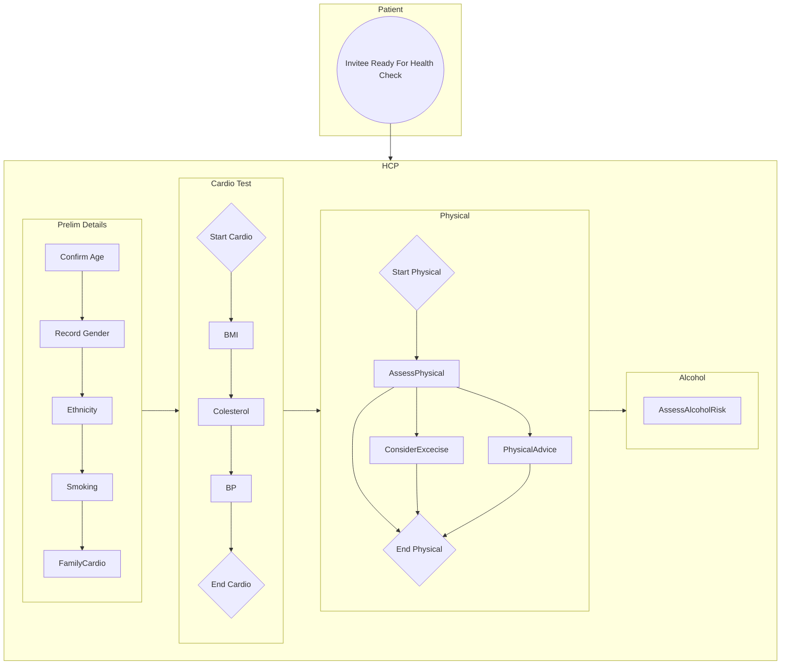

> ⚠️ **Warning**
>  
> **Draft Documents**: May not represent real world scenarios, may not be fully accurate or complete.
>
> Please contact the author for more information.

# Health Check User Flow
Diagram being built from https://github.com/RossBugginsNHS/nhs-experience/issues/1

