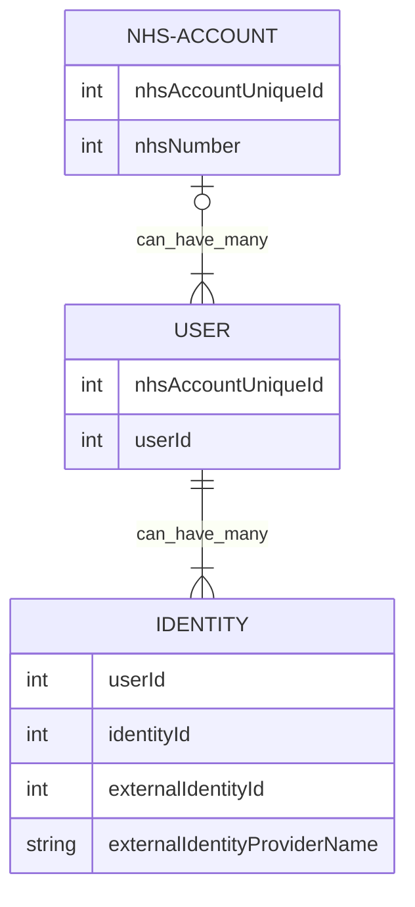



  

    Table of contents
  

  {: .text-delta }
1. TOC
{:toc}

## Account Vision - Giving Data Context

### What is Context?

## NHS Preparing for NHS TGR

https://architecture.digital.nhs.uk/trg

TRG submissions are made up of two main artefacts, the Solution Design Overview (SDO) and Key Architecture Decision (KAD). 

### Solution Design Overview (SDO)

### Key Architecture Decision (KAD)

### CCCs

They will look to gauge your awareness of and alignment to policies and standards and your consideration and engagement with each of these areas within your proposed programme/activity. They may require further information.

The CCC owner will review what is on the portal and will either approve, ignore (if it isn’t relevant), reject or ask questions for clarification. It is your responsibility to respond to any CCC questions or concerns in a timely manner to ensure no delays at TRG.

- Data
- Development
- Enterpise Architecture
- Infrastructure
- Interoperability
- Live Services SM
- Security
- Solution Assurance
- Sustainability 
- Usability 
- Accessibility

## Frequently Asked Questions

### How does Proxy fit into this?

- Proving legal relationships

### Safeguarding & IG

- Account deals with Authorisation & data "routing" / storage
- Applications of Account, need to deal with "Usage"
- Developer Apps - only have context of the developers account
- Apps need approval to be avaliable to all from NHS
- Citizen consents to any app using any Account data - in a granular way

### How does this help developers?

Make life easier for developers = Better Products and Better Services
  
- Standard authorisation model
- Data Exposed by Account is already covered by IG
- IG implications are on the App, on how they use it, but only once "released"
- Allow developers to onboard their own apps, for testing and development - restricted to the context of their "Developer" NHS Account
- Allow Beta groups - ie apps enabled for subsets of users
- Remove need to onboard an app with Login, and CIS, and nhs.net - no need to worry about the IdP that is to be used
  
### Where does NHS Login fit into this?

- NHS Login is just 1 of many different Identity Providers supported
- Account is the context of NHS Number, **NOT** NHS Login
- Supports 1 Account having many user accounts with each user account having different levels of access
- Supports 1 User having many different identities, from many different identity providers
- A User with an identity does not have any permissions by default
- Authorisation happens separately, and after, authentication - Permissions are granted by account based on rules, including attributes and roles

## Who is / should be involved?

### NHSE Citizen Experience

### IAM

### "Platform" - NHS App & NHS uk

### Data & Interop

### NHS E Innovation

### Who does what

### SCR

### NHS Login

### GPIT / GP Connect

### MOJ?

### Prison Service?

### Others?

> ## Notes from 07/11/2022
>
> NHS Account
>
> NHS Account Access Control
> NHS Account Graph (NHS Account "Data")
>
> NHS Account Client Apps
> NHS Account Data Connectors
>
> Authorisation as a Service
>
> - Make NHS Login "Contextless"
>
> Account Access control - this has:
>
> - Controlling who has access to what
> - NHS Login is the "Who"
> - Account Access Control is the "Who has access to What"
> - Proxy "updates" the Access Control automatically
>
>
> Support more than NHS Login
>
> - CIS2 - sharing with Staff
> - OneGov - other ID provider
> - For Digital VCs (Proxy) We Need this multiple IdP support for credential proving
> 
> NHS Account Access Control (AAC) - Authorisation as a Service
>
> - Multiple IdP support
> - NHS Account keeps context of the NHS Number
> - Allows NHS Login is Contextless
> - Removes the need for NHS login to be modified
> - In Future, apps and platforms onboard with NHS Account, NOT NHS Login
>
> Authentication as a Service
>
> - Single gateway for Access Control. GP Connect, SCR, App, UK, Primary and Secondary
> - Supports User Consented Sharing of data between citizens, and citizens to health professionals
>
> It's the "Missing Link" Between IdPs (NHS Login), Client Apps (NHS England Mobile App), and data sources (GP Connect, PDS etc).
>
> NHS Account Graph
>
> Data and functionality exposed to the citizen, in the context of the NHS Account. IE anything exposed as part of NHS Account Graph has support for "Proxy" and User consented access sharing

## History of Account & Proxy

- Account and Proxy separate services
- Proxy for delegating access to Primary care records
- Account was a term used for grouping together functionality for a citizen to update their info
- It wasn't "a thing"
- Proxy was proving relationships, recording them, and storing what access was available with them

## Suggested

## NHS AEG Presentation 2022-09-30 



### Account "Control"

- Account designed as Authorisation platform
- Controls who can access what and via what client apps
- Standard oauth scopes + UMA
- Account stores an NHS number which is the context for all account operations - not the NHS number that is part of the NHS Login identity
- All data and functionality exposed via NHS Account does not need to worry about "Proxy". The standard authorisation of Account Control has taken care of that.

### Account "Data"

- Account Data - standardised data API endpoint to enforce Account authorisation rules

### Proxy

- Service that is used for validating external relationship and identity proofs
- Updates account control to set desired access based on the proofs given

### Why?

- Account "Control" becomes authorisation as a platform
- Account "Data" becomes an API endpoint (gateway) platform with standard authorisation model

### Organisation Controlled Apps with User Contented Access to what apps can use data on their behalf

- Users consent to what data is used with what app
- eg Citizen consents to "Blood Pressure Readings" being read by NHS App
- Consent is for both "primary" apps eg NHS App, other NHS developed apps, eg Digital Health Check, and would be the same for third party apps
- The organisation(s) eg NHS England - control what apps are added as available to the Account Platform
- Local Organisations could control what subset of these apps are available to citizens in their area
- Users choose what apps they want "installed" into their account
- USers then consent to what data is shared with those applications
- Users can easily view all apps they have consented to and what "access" levels they have. Can revoke at any time.

### Controlling Who

- Citizens can see a list of users that they have "added" to their account and what access they have.
- Can add, remove or modify at any time
- Proxy service works with this to update the list based on external proofs, without their involvement.

#### Example "Account Apps"

- NHS App England
- NHS App Wales - eg user wants to share data with Wales App - maybe they live on the border and it would make life easier for them for data to be accessible there
- A "NHS Digital Health Check" - if an app developed by OHID, they may want to store data in an account, eg blood pressure, but also work to expose the results of the Health Check through the "Account Data" platform.
- A "Health Analysis Service" - a background service developed by NHS that monitors users self generated obs (eg Blood pressure) and also GP added BP readings. Allowing real time analysis to spot problems early.
- A third party developed Sleep Apnoea service - monitoring both data from CPAP for a user (already existing by supplier) but also wearables data. Supplier also exposes summary data to "Account Data" to allow it to be easily consumed inside NHS (with users specific consent)/ 

## Diagram

[Latest Version of Whiteboard diagram](https://app.diagrams.net/#Uhttps%3A%2F%2Fraw.githubusercontent.com%2FRossBugginsNHS%2Fnhs-experience%2Flatest%2Fdocs%2Fnhs-account-v2%2FProxy%2520and%2520Account.drawio)

Note - preview here may not be latest version.

## Notes

Account is a Platform

Account

- Account Control
- Account Roles
- Account Resources (Data)
- Account Apps
- Account Clients
- Apps as a Service
- Data Sources as a Service
- Authorisation
- 

Account Resource

- Data
- Information
- Knowledge
- Wisdom

Testing 2

- Account control
- Account data
- Authorisation
- Proxy
- Data Sources / Resource
- Identity

To involve

- platform app / uk
- SCR
- GP IT

## Community Questions and Answers

### NHS AEG 2022-09-30

#### [10:12] DS

To your point Ross, when I saw Proxy Access on the agenda – I did immediately jump to Proxy Services for 'Web access Internet/Intranet' etc. as opposed to being related to the NHS App.

*Glad I highlighted it. The assumption “masking the true origin” that tech people make when they hear the word proxy is a real danger of NHS Proxy not doing what it really should*

#### [10:13] PG

I’m in a busy place so will type a few things …. Have you contacted the NHSE people doing the digital identity stuff with staff… it’s just about people … DCMS doing a lot of work on Digital Identity and Trust frameworks … MoJ doing things with power of eterny … does NHS Login fit with the DCMS framework …. Also need to look at wallets and decentralised identity
like 1

*Have been doing work with MOJ, getting a plan in place of how we work together on this.*

*Have spoken briefly to E re the Staff Passport, and have spoken to one of the suppliers who was involved with the Staff Passport VCs*

#### [10:13] CL

Isn't it policy to only have a single NHSID for an individual - if so isn't there a process to reconcile those breaches ?

*I personally don’t know the policy – however, all I know is that a friend of mine has ended up with two separate NHS numbers (happened about 4/5 years back) but no one knows why – has meant that she has a a real nightmare with data pre and post the switch.*

#### [10:13] PH

We also need to think about how we use our own identites outside the NHS.

*Yes – and this is really highlighted that NHS Login is just the identity. And it could be one of many identities.*

*“We” trust NHS Login with P9 as we trust NHS Login has check the identity biometrically when the P9 was issues. We should also trust a DVLA identity, or a HMPO office identity – as they have both biometrically proved that that identity is that person. The “Users” in account could be linked to Any IdP – NHS Login, DVLA, Gov UK etc etc – any that Account decided it “Trusts”*

#### [10:14] CL

(I ask as I dont know if it is policy, but assumed it was)

#### [10:15] PG

Government also looking at one login to government services … are we a government service ?

*I’m not a fan at all of concept of the single government login, but yes I know they are working on it.*

*If different orgs issue proofs of identity in a standard way, and trust different identity providers for each org, there is not really a need for a central gov IdP.*

*By supporting multiple IdPs it empowers citizen to choose what Identity provider they use.*

*They might not want a central gov identity knowing they have just logged into NHS, or DVLA. But on other hand, some might not care.*

*Also a Single IdP is a single point of failure.  “I” should be able to link 1 or 2 or 3 Identity’s to my NHS account, from different IdPs. They might have different levels of access. The NHS Account Authorisation might also enforce its own access rules based on which IdP is being used.*
like 1

#### [10:15] PG

Also need to make sure we don’t go down a product route but a capability one
like 3(4)

#### [10:16] PG

If I have a digital identity then I should be able to use that with NHS Login and not prove who I am again.

*Yes – NHS Login should be able to take VC from DVLA, or MHPO or GRO – and we can treat that as a P9 NHS Login – we shouldn’t have to have the citizen re prove when they already have that proof.*

#### [10:16] YM

Do we have ABB2C for users to have a single point auth

*Using Azure AD B2C at the moment for Poc work – the RFC is out there now to understand if / who is looking at different authorisation options – but im trying to make sure not focused on what product can offer this, but what we want capability wise*

#### [10:17] KD

Ross Buggins - it would be useful to have a chat as we are on our own journey (UKHSA) on API and authorisation aspects.

*Any time – drop me an email and we can get it in the diary*

#### [10:17] PG

Is this picking up on the work that MS  was doing ?

*MS recruited me – I started in March and then he left in April – so yes, building upon what he has started*
like 1

#### [10:18] PG

Attributes and verifiable credentials

*See above*

#### [10:20] PG

Issue to a personal ‘wallet’ linked to a digital identity

*See above*

#### [10:21] BW

need to link with the social care agenda from the outset including the current round of planning for greater digital enablement in adults and children's social care

*Yes – as part of the Parent Child “rule” we want to find out more about how social care come in to play.
IE – we have a VC proving an adult is a parent of a child. However, do we also need a VC from local children's social care Proving there are no restrictions on that adult stopping access to that child. Do we then also need one from MOJ proving there are no criminal related restrictions stopping that adults contact with any children?*

*We then combine all those VCs, and issue one saying “we are happy that parent can access child details”. If MOJ or child care then do have a restriction, they revoke their VC – we then know to revoke our own based on that.*

*Also looking at revoking, it brings an interesting thought around marriage and divorce certificates. Instead having to check a digital divorce certificate, GRO just revoke the marriage one, meaning its not longer valid.
Also, to supplement birth and death certs, you could have a “living” VC – ie issues when you are born, but revoked when you die – then it doesn’t need checking.*

*Then raises an interesting one of, should the NHS issue a VC to the mother (the holder) about a new born (subject) when first registered on PDS? This VC is the first digital proof of that child. Its then supplied to GRO when issuing a digital birth cert, along with a fathers identity VC – which then combines the child Id, with both parents. The birth cert could be then issues to both parents as holders. While the child is a child, the parents can use it a proof of identity on behalf of the child. But on 18th birthday the parents can no longer use it on behalf – for them it just becomes a VC proving relationship.*
like 2

#### [10:22] PG

Nice

#### [10:22] PG

S FOUNDATION TRUST)
SM?

*Yup, he was indeed there last week!*
#### [10:22] CC

Can see The GP intervention/process being a blocker /  Have all GP's agreed to take this on?  Any feedback from this?

*MVP will start small, I believe the team have identified where it would be focused first.*

*Yes it still has GP staff requirements, but a least it is removing some of the burden of checking*

#### [10:24] PG

This is the stuff we are doing in the Digital Staff Passport work … W3C Verifiable Credentials

*Yup – so would really be keen to have a deep dive into whats worked and what has been pain points and what we can learn from it.*

#### [10:24] RI

On the multiple NHS Number thing, I would not invest too much in that. Such cases need to logged with National Back Office to sort out, rather than trying to live with multiple numbers. Ross - perhaps have a chat about this?

*Thanks – will do!*

#### [10:24] YM

Are we looking at 121 or 1 2many relationships for these proxies and certificates from a user perspective

*Power of Attorney is an interesting one here
On 1 PoA application, you can name many people – and they all have to sign that same paper.
However, there is nothing stopping you filling out another PoA giving someone else, and right now, there is nothing making sure the people on PoA 1 know about PoA 2 and vice-versa.*

#### [10:26] BW

opportunity for improving care / care records for adoptions where the NHS number is rightly changed but some access to some records are essential (complex area)

*Yes, when I was at KMPT I saw the pains around NHS Number changes, gender changes, prison NHS numbers, adoption etc – sometimes its wanted for them to be “linked” other times not at all*

#### [10:26] RI

Indeed it is complex

#### [10:26] PG

Yes … using SSI you can self attest things … got to be careful about coercion

*Agreed, but that is a problem now with non digital. For example PoA needs a legal witness. The same could happen with a digital PoA – it takes 3 identities, the “donor” the “receiver” and the “witness”*

*Note – when dealing with MOJ and PoA you hear the work Donor a lot – don’t mistake with organ donor.! 
But talking of organ donation – this would be prime for a VC to keep in your wallet and share with others. Someone could easily prove on your behalf. (Think out of the country, and they trust the NHS issues organ donor VC…, but not need any access to your medical records) Although have no idea of legalities of organ donation if death abroad – but a useful illustration. *

#### [10:26] IH

BW opportunity for improving care / care records for adoptions where the NHS number is rightly changed but some access to some records are essential (complex area)
Pre and post adoption was the scenario I was thinking

*See above*

#### [10:27]BW

IH Pre and post adoption was the scenario I was thinking

happy to discuss - have got case study

#### [10:27] PG

Are you looking at wallets?… do have a look at the open wallet stuff from Linux … also look at the EU eIDAS stuff

*Yup – have started. At moment played with the MS authenticator wallet capabilities. But open to all. Also was talk last week with Simon M, about SOLID PODS, and storing of creds, but also not having a central Authorisation service at all – but everyone’s authorisation attributes / roles / rules stored in PODS, that could be hosted anywhere – opens a whole new discussion…!!!!*

#### [10:28] RI

It has on the cards for ages that adoptees are NOT given new numbers, except in high risk cases. In low good reason for changing in low risk cases. DfE has been dragging it's heals for years!

#### [10:28] YM

How does the security of the digital info is maintained should any code  is compromised through the device

*Same tech that protects bank card stored digitally or covid pass or ticket. keys stored in the encrypted part of the phone that only unlocks when bio metrically.*

*But wallets don’t actually have to just be phone, for example the private keys for signing VCs could be stored in SOLID PODs (see few comments above as a whole other conversation).*

*Also, with VC using Decentralised Identifiers – the revoke status (or how to find it) its stored in immutable data store, so if revoked, its very easy for anyone to check.*

#### [10:28] PG

Also look at the OIDC stuff that is going on… we did something with EMIS

Could I have a pointer please?

#### [10:30] PG

Yes please .. and PS
?

#### [10:31] YM

From a process and IG perspective should it lot more simple where patient data is accessed by the doctor and doctor can take a decision should the patient be incapacitated rather than providing providing proxy to another individual

*Proving the PoA digitally is “easy” in that it can be done. But there is still a burden on how a staff member decides if someone is incapacitated. It could be that if a doctor says yes, this person is incapacitated (and gives a validity time – as capacity to make decisions can come and go) – that could be issued as a VC. A paramedic that doesn’t have access to full medical record could validate that proof, along with a PoA proof – and there is no burden on them to have to make that decision.*

#### [10:32] JD

We have considered this in Wales too - some issues include proxy access across different GP practices and IT systems - is that something being considered?

*Yes – and that’s where suggesting Account comes in. And where we need to talk to GPIT about exposing GP held data through a single endpoint. As at the moment the fact that IM1 is so hard, and doesn’t work for the purpose it should, and GP Connect is still a long way away – how can a drive Account work hand in hand with driving “gp connect” and data access forward.*

#### [10:33] JS

You drew some parallels with COVIDPass - wonder if you see any reuse of that model/architecture model or physical reuse of that service?

*That and digital staff passport – there is a lot to be learnt from both – so want to have involved anyone who is/was involved with both.*

#### [10:34] BW

Ross Buggins worth linking with PRSB on their work on "About Me" (more about preferences than identity)

*Any contacts – please let me know.!*

#### [10:34] JS

This would be really relevant to the NHS BSA too - things like managing services and entitlements - Prescription Prepayment Certs, etc, etc.

*Any contacts – please let me know.!*

*Yes – totally. And also, just imagine if you issue a VC that is valid for 1 hour, that entitles the holder to pick up prescription on your behalf?*

#### [10:34] BW

Joanna Dundon (DHCW - Digital Services for Patients and Public) some of this that Ross Buggins has presented reminds me of the pan-Wales AFCP work as well

*Any contacts / resources avaliable – please let me know.!*

#### [10:35] DS

Not to undermine the Programme, but lots of talk about Proxy for Primary Care, but not to lose sight that we are being pushed to deploy PEP’s (Patient Engagement Portals) in ICS's which span Primary, Community, Acute and Social Care.  I assume we could plug this Proxy service in to a PEP like we can NHS Login for ID verification.
Account needs to span primary and secondary and all health care. It should be a single endpoint that has a standard API model, and standard auth model, that allows onboarding of existing and new data sources. And having core of the auth in account, proxy can tie into all of this. 

*Agreed, the first MVP we are talking about is focused on GP primary care records, but this needs to move past this. The citizen doesn’t get that primary care records are held in different systems, and that there is likely copies of most of secondard care records there too. The sprawl of silos doesn’t necessarily have to end – but need a way of unifying this – and I know, shared care records, NRL, GP Connect etc all are doing/trying to do this, so why is this any different?  I guess that’s why I used the Microsoft analogies – they had disparate systems, spanning many continents – but they have managed to unify them, but only with that flexibly unified authorisation platform supporting it.*

*Proxy needs outside of NHS – Yes it can happen. If we can get the “sources of the truths” to work together and issue VCs, then different orgs can decide upon who they trust to issue what, and then make decisions based on that.*

#### [10:35] JD

BW JD some of this that Ross Buggins has presented reminds me of the pan-Wales AFCP work as well

*Thanks BW would be good to find out where you are with that*

#### [10:37] BW

JD BW would be good to find out where you are with that will put something in the diary, WCCIS next stage kicking off as well

*Any contacts / resources available – please let me know.!*

