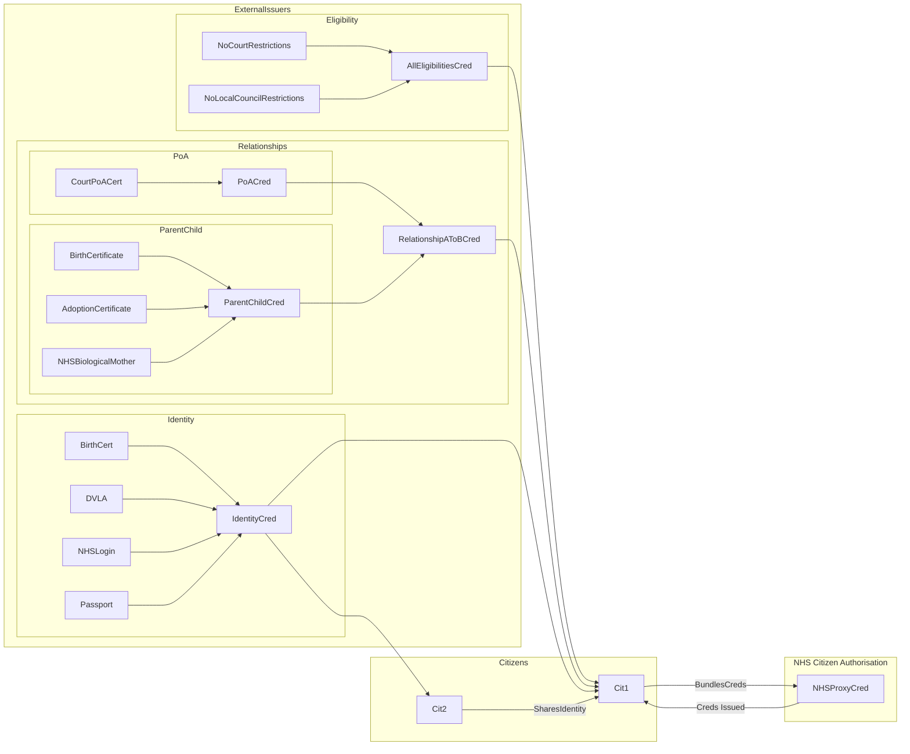

> ⚠️ **Warning**
>  
> **Draft Documents**: May not represent real world scenarios, may not be fully accurate or complete.
>
> Please contact the author for more information.

# What do we need Proving to allow access?

## Access to own records

## Access to anther's records

We need proved:
- The targets identity
- The accessors identity
- The relationship
- That there are no "Restrictions" in places

### What relationships are there?
- Parent to Child
- Power of Attorney
  
### What are restrictions?
- Court Orders
- GP Objections?

### Identifiers
- NHS - NHS Numbers

## Verifiable Credentials for Children - No Digital Wallet
A child (the subject) needs a digital verfiable credential. But without a digital wallet, it needs to be held by someone else (the holder).

https://sphereon.com/verifiable-credentials-example/

Anand is still a toddler and does not have his own digital wallet to hold his Verifiable Credentials. That is not a problem in the W3C Digital Identities system, as it accommodates the concept of Guardianship for minors or incapacitated individuals.

### dId's
A portable URL-based identifier, also known as a DID, associated with an entity. These identifiers are most often used in a verifiable credential and are associated with subjects such that a verifiable credential itself can be easily ported from one repository to another without the need to reissue the credential. An example of a DID is did:example:123456abcdef.

https://www.w3.org/TR/vc-data-model/#dfn-decentralized-identifiers

## Dependency on external issuers for proof of identity, relationships and eligibility restrictions.
