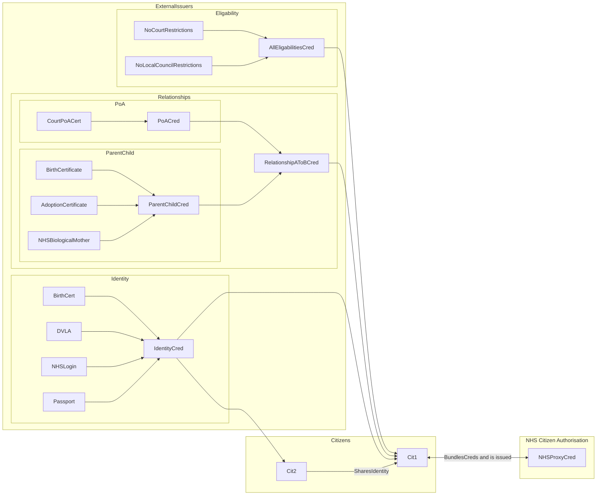

> ⚠️ **Warning**
>  
> **Draft Documents**: May not represent real world scenarios, may not be fully accurate or complete.
>
> Please contact the author for more information.

## Dependency on external issuers for proof of identity, relationships and eligibility restrictions.
