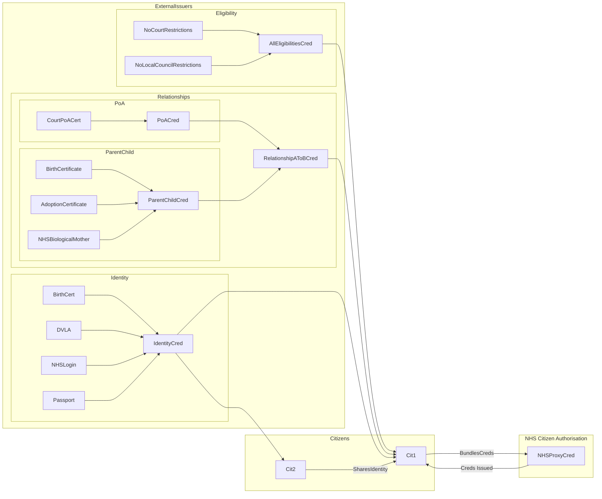

> ⚠️ **Warning**
>  
> **Draft Documents**: May not represent real world scenarios, may not be fully accurate or complete.
>
> Please contact the author for more information.

# What do we need Proving to allow access?

## Access to own records

## Access to anther's records

We need proved:
- The targets identity
- The accessors identity
- The relationship
- That there are no "Restrictions" in places

### What relationships are there?
- Parent to Child
- Power of Attorney
### What are restrictions?
- Court Orders
- GP Objections?
- 

## Dependency on external issuers for proof of identity, relationships and eligibility restrictions.
