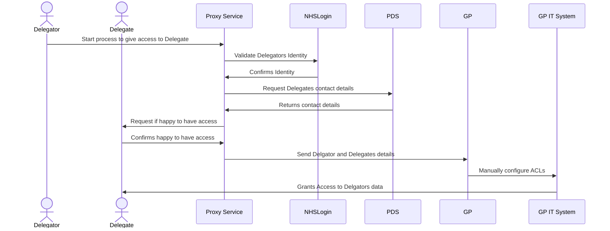

# What is NHS Proxy?

NHS Proxy is a term used to define one citizen having the ability to .......

# Aims
- Reduce burden on NHS Staff
- Move burnden of proof to issuers
- Ease process for citizen

# Will Need
- Cooperation between organisations



  

    <section data-auto-animate data-background-gradient="linear-gradient(to bottom, #283b95, #17b2c3)">
      <h2>🍦</h2>
    </section>
    <section data-auto-animate>
        <h1>Slide 1 - Title</h1>
        
Let's make some bullet points!

        <ul>
            <li class="fragment">Some info</li>
            <li class="fragment">Some more info</li>
            <li class="fragment">Some extra info</li>
        </ul>
    </section>
    <section data-auto-animate>
      <pre><code data-trim data-noescape data-line-numbers>
        (def lazy-fib
          (concat
          [0 1]
          ((fn rfib [a b]
                (lazy-cons (+ a b) (rfib b (+ a b)))) 0 1)))
      </code></pre>
    </section>
  

## To Architect
  

  
- Authentication
- Authorisation
- Data model of credentials and presentations
- Proxy relationship establishment application
- Credential validation service
- Decentralised identifier (DID) documents
- Trust framework system
- Credential gateway

## Definitions

Identity / Authentication vs Authorisation

Proxy - "Imitating the Identity"

Delegated Access

Role Based Access

# Proxy Service MVP - June 2023?
## Deglatation

