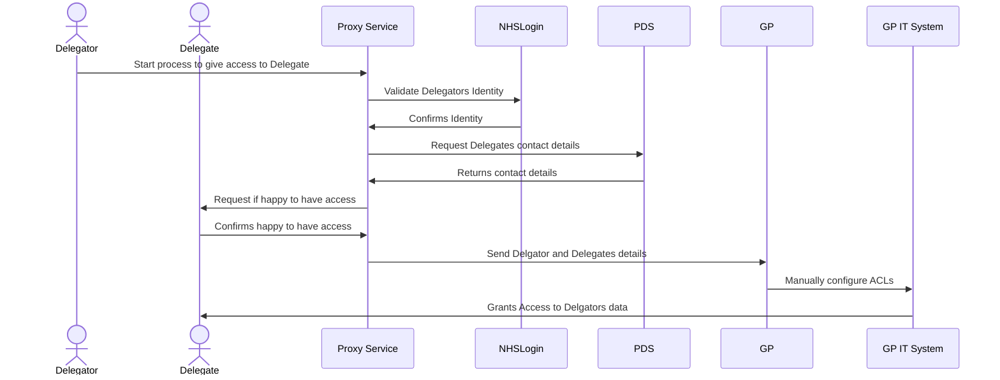

> ⚠️ **Warning**
>  
> **Draft Documents**: May not represent real world scenarios, may not be fully accurate or complete.
>
> Please contact the author for more information.

# What is NHS Proxy?

## To Architect
  

  
- Authentication
- Authorisation
- Data model of credentials and presentations
- Proxy relationship establishment application
- Credential validation service
- Decentralised identifier (DID) documents
- Trust framework system
- Credential gateway

## Definitions

Identity / Authentication vs Authorisation

Proxy - "Imitating the Identity"

Delegated Access

Role Based Access

# Proxy Service MVP - June 2023?
## Deglatation

