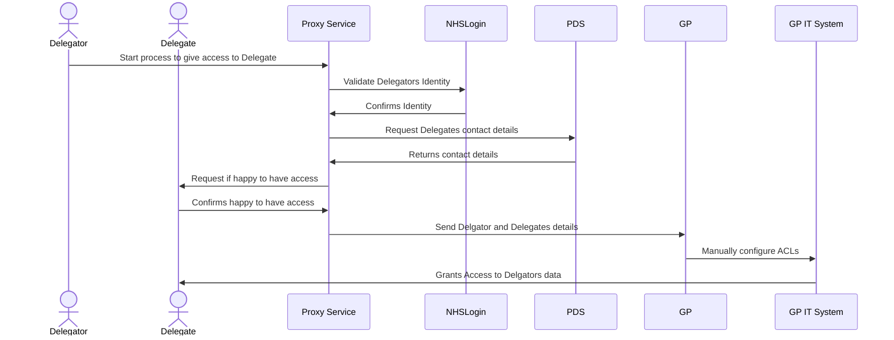

# What is NHS Proxy?

NHS Proxy is a term used to define one citizen having the ability to .......

# Aims
- Reduce burden on NHS Staff
- Move burnden of proof to issuers
- Ease process for citizen

# Will Need
- Cooperation between organisations



 




## something

<section data-markdown="/_slides/p2.md">
</section>

## To Architect
  

  
- Authentication
- Authorisation
- Data model of credentials and presentations
- Proxy relationship establishment application
- Credential validation service
- Decentralised identifier (DID) documents
- Trust framework system
- Credential gateway

## Definitions

Identity / Authentication vs Authorisation

Proxy - "Imitating the Identity"

Delegated Access

Role Based Access

# Proxy Service MVP - June 2023?
## Deglatation

