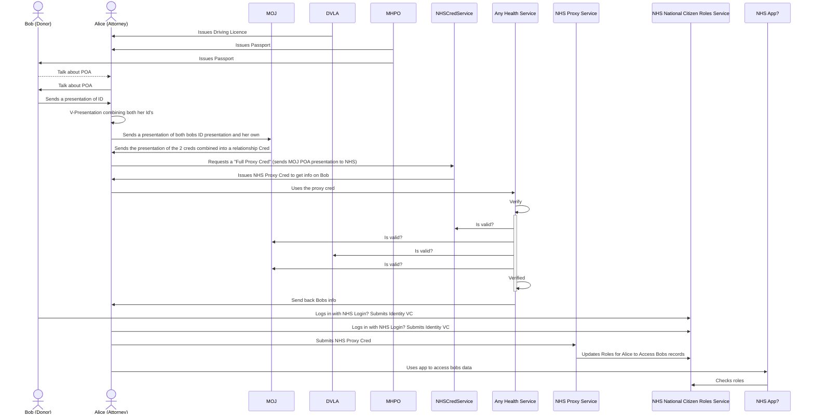

## Attendees
- NHS

## Presentation of claims / creds

good example of complex presentations of different claims: https://www.w3.org/TR/vc-use-cases/#citizenship-by-parentage

https://w3c.github.io/vc-data-integrity/

https://www.w3.org/TR/vc-imp-guide/#presentations

Verifiable credentials may be presented to a verifier by using a verifiable presentation. A verifiable presentation can be targeted to a specific verifier by using a Linked Data Proof that includes a domain and challenge. This also helps prevent a verifier from reusing a verifiable presentation as their own.
<https://teams.microsoft.com/l/message/19:6az8NFeybJtdhw02k_QTs96uDwsJ8SedAqVMxAwtEMQ1@thread.tacv2/1663765780130?tenantId=03159e92-72c6-4b23-a64a-af50e790adbf&amp;groupId=d0d7cfd1-fc68-4c74-ab36-101f83ca7993&amp;parentMessageId=1663762338242&amp;teamName=Verifiable Credentials&amp;channelName=General&amp;createdTime=1663765780130&amp;allowXTenantAccess=false>

## Proof Sets & Proof Chains
https://w3c.github.io/vc-data-integrity/#proof-sets

2.1.1 Proof Sets

A proof set is useful when the same data needs to be secured by multiple entities, but where the order of proofs does not matter, such as in the case of a set of signatures on a contract. A proof set, which has no order, is represented by associating a set of proofs with the proof key in a document.

2.1.2 Proof Chains

A proof chain is useful when the same data needs to be signed by multiple entities and the order of when the proofs occurred matters, such as in the case of a notary counter-signing a proof that had been created on a document. A proof chain, where order needs to be preserved, is represented by associating an ordered list of proofs with the proofChain key in a document.

## Unlinkability...
https://w3c.github.io/vc-data-integrity/#unlinkability

## zero-knowledge
https://w3c.github.io/vc-data-integrity/#unlinkability

A zero-knowledge proof is a cryptographic method where an entity can prove to another entity that they know a certain value without disclosing the actual value. A real-world example is proving that an accredited university has granted a degree to you without revealing your identity or any other personally identifiable information contained on the degree.

The key capabilities introduced by zero-knowledge proof mechanisms are the ability of a holder to:

Combine multiple verifiable credentials from multiple issuers into a single verifiable presentation without revealing verifiable credential or subject identifiers to the verifier. This makes it more difficult for the verifier to collude with any of the issuers regarding the issued verifiable credentials.
	
Selectively disclose the claims in a verifiable credential to a verifier without requiring the issuance of multiple atomic verifiable credentials. This allows a holder to provide a verifier with precisely the information they need and nothing more.
	
Produce a derived verifiable credential that is formatted according to the verifier's data schema instead of the issuer's, without needing to involve the issuer after verifiable credential issuance. This provides a great deal of flexibility for holders to use their issued verifiable credentials.
	
For a holder to use a zero-knowledge verifiable presentation, they need an issuer to have issued a verifiable credential in a manner that enables the holder to derive a proof from the originally issued verifiable credential, so that the holder can present the information to a verifier in a privacy-enhancing manner. This implies that the holder can prove the validity of the issuer's signature without revealing the values that were signed, or when only revealing certain selected values. The standard practice is to do so by proving knowledge of the signature, without revealing the signature itself. There are two requirements for verifiable credentials when they are to be used in zero-knowledge proof systems.

