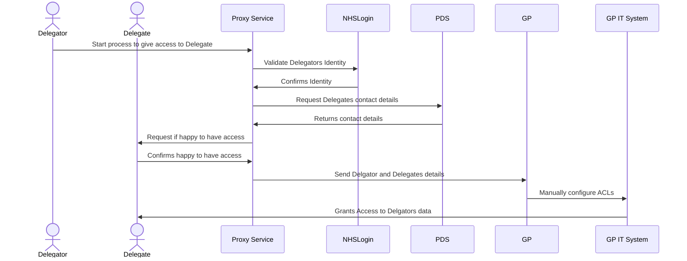



# What is NHS Proxy?

## The aim
The goal for NHS Proxy is *"To create a standard approach to allow people to act on behalf of the patients and dependents they care for and to allow users of NHS digital services to share their records with those they trust to act on their behalf"* [^digital-proxy-service-2022]

## How we got here

## What data, and where is it?
## Words and Definitions

## Benefits

> *Over recent years there have been a number of attempts to develop a digital proxy service for patients, where users are able to nominate a trusted individual to help manage their care.  Manual proxy services are available across GP records in some locations, there is a limited ‘linked profiles’ capability in the NHS APP and some digital services are available at a local level by third party suppliers (e.g. Patients Know Best), but there is currently no national, digitally enabled service available to all.* 
> 
> *We need this capability to be available if we are to successfully deliver a number of other digital services which are being developed across the health system including the Digital Child Health and Maternity services, NHS Account, and Covid pass for children as some initial use cases.* 
> 
> *The SofS for Health and Social Care and the Director for Transformation, NHS England and Improvement have made commitments to establish a comprehensive, digital proxy service and these have been enshrined in ministerial commitments and delivery plans, with an increasing urgency on the pace of this work.*
> 
> *After a three month design phase conducted by SiteKit we now have a plan of work to develop this service.  This piece of work highlighted that there are gaps, both in digital policy and Information Governance frameworks that we need to fill. As agreed in the NDC roadmap 22/23 we will develop this work, alongside a high level architecture for the first use cases of Adult-to-Adult and Adult*-to-Child.  In 23/24 we have planned to complete the architecture design and move from alpha to a beta service for users.*
>
> *Extract from Digital Proxy Service 2022 - Briefing Paper [^digital-proxy-service-2022]*

[^digital-proxy-service-2022]:Digital Proxy Service 2022 - Briefing Paper

    - Reference: [Digital Proxy Service 2022 - Briefing Paper]({{ghrawurl|append:"/blobs/digital-proxy-service-2022-briefing-paper.pptx"}})
    - Type: PowerPoint
    - Last Checked: 27/09/2022



---



next





# What is NHS Proxy?

NHS Proxy is a term used to define one citizen having the ability to .......

# Aims
- Reduce burden on NHS Staff
- Move burnden of proof to issuers
- Ease process for citizen

# Will Need
- Cooperation between organisations

## something

## To Architect
  

  
- Authentication
- Authorisation
- Data model of credentials and presentations
- Proxy relationship establishment application
- Credential validation service
- Decentralised identifier (DID) documents
- Trust framework system
- Credential gateway

## Definitions

Identity / Authentication vs Authorisation

Proxy - "Imitating the Identity"

Delegated Access

Role Based Access

# Proxy Service MVP - June 2023?
## Deglatation

