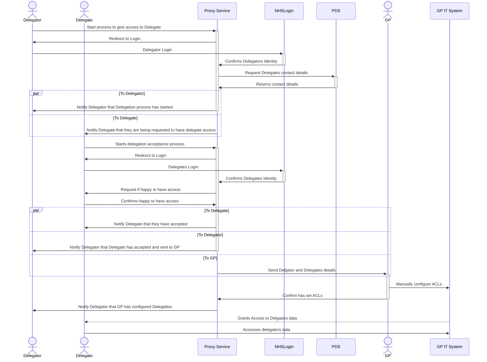

# Summary

# Non Technical Requirements

## Process Flow

# Benefits

# Technical Requirements

## Actors Involved

### Delgate

### Delegator

### GP Staff

## External Systems Involved

### NHS Login

### PDS

### Email / Mesh

## New Services / System Required

### NHS Proxy Service

## Data Inputs

### Delegates details (supplied by delegator)
- NHS Number
- Email
- Dob
- First Name
- Surname

### Delegates contact details 
Supplied from PDS Lookup

## Data Outputs

## Processing / Validation

### Validate Delegates details (supplied by delegator) and lookup delegates contact details
Details for delegate that are supplied by delegator (i.e. who to "invite") should be verified against PDS

