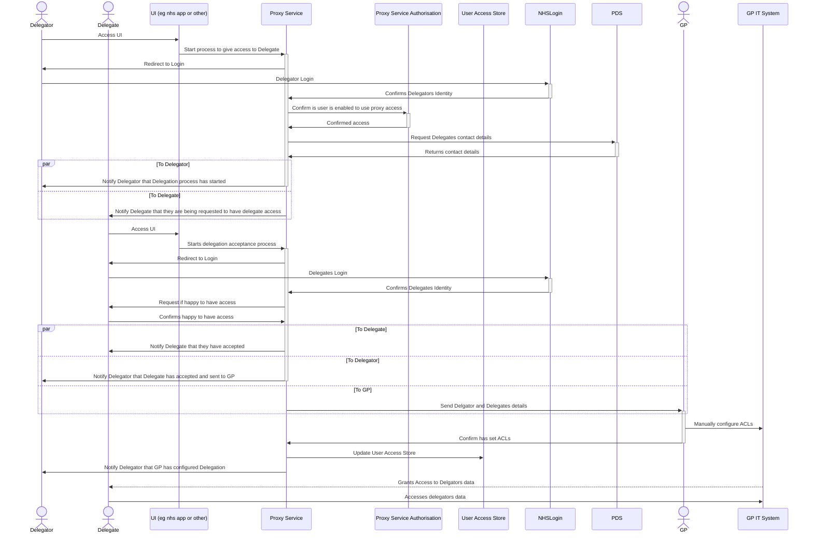

  

    Table of contents
  

  {: .text-delta }
1. TOC
{:toc}

# Summary
A small central service to allow citizens to delegate proxy access to their GP record to someone else.

## Non Technical Requirements
- Allow citizen to delegate proxy access to someone else

## Restrictions
- List of GP practises to be restricted to those in trial

## Benefits
- Easier for citizen to give access
- Easier for citizen to receive access

## Non Benefits
- Process still manual for GP Staff

## Clarifications
- Only for controlling access to GP records
- But storing this request centrally (i.e. used in future)

## Process Flow

# Technical Requirements

## Actors Involved

### Delgate
The citizen who wants to allow someone else to have access to their records.

### Delegator
The citizen who will have access to someone else's record.

### GP Staff
The person who received the (verified) request and then has to manually update the GP system access controls.

## External Systems Involved

### User Interface (UI)
- For minimising dependancies, could be standalone
- Would be good to integrate into nhs uk / nhs app
- But should not be a blocker to delivering MVP

### NHS Login
- Used to authenticate the identity of both the delegator and delegate

### PDS
- Used to verify the delegate details provided by the delegator
- User to lookup the contact details (email or phone?) of the delegate

### Email / Mesh
- Used to communicate the proxy request to the GP surgery

## New Services / System Required

### NHS Proxy Service
Used to orchestrate and expose the proxy process

#### Could Include microservices of:
- API
- Command Handling
- Event Raising
- Event Handling

### Proxy Service Authorisation
- Control Scopes for who is allowed to use proxy service
- OAuth Authorisation using NHS Login as external IdP

### Access Data Store
- Storing who has access to what

## Data Inputs

### Delegates details (supplied by delegator)
- NHS Number
- Email
- Dob
- First Name
- Surname

### Delegates contact details 
Supplied from PDS Lookup

## Data Outputs

### To GP
- Delegator NHS Number
- Delegator Name
- Delegate NHS Number
- Delegate Name
- Date of request
- Date of request accepted

## Meta Data / Event / Command Data

### Delgation Process
- Started By
- Started Date
- Delegate Invite Sent Date
- Delegates Response
- Delegates Response Date
- Sent to GP Date
- Action Confirmed by GP (t/f)
- Action Confirmed by GP Date

## Authorisation Data
- List of GP Practise codes that are enabled for MVP

## Commands

### Delegate Request

Created when a delegate creates the request to start the delegation process.
#### Payload
- Date
- Delegates NHS Number
- Delgators NHS Number

### Accept Delegation

### Decline Delegation 

### Revoke Delegation
When a delegate or delgator revoked the delegation

#### Payload
- DelegationId
- Revoker
- Revoke Requested Date

## Events

### Delegate Request Process Started

### Delegate Details Confirmed

### Delegate Contact Details Found

### Delegation Request Process Accepted

### Delegation Request Process Declined

### Delegation Request Applied 
Raised after GP has confirmed they have set proxy access in their system.

### Delegate Request Process Finished
Raised after everything has been done for the delegation request

## Scopes

### proxy.request.create
- Required by delegate to be able to create a request
- Should be based on if delegate is at a GP that supports proxy MVP

### proxy.request.respond
- Required by delegator to be able to respond to a request
- Should be based on if delegator is at a GP that supports proxy MVP

### proxy.request.confirm
- Required by GP staff to be able to update that request has been process

### proxy.view
- View fully details of the proxy request
  
### user.roles.view
- Views list of assigned roles / access - ie the assigned access that happened due to the proxy request (and if it is still active)

*note: GP staff need to be logged in?*

## Processing / Validation

### Verify Delegates details (supplied by delegator) and lookup delegates contact details
Details for delegate that are supplied by delegator (i.e. who to "invite") should be verified against PDS

### Collate details for sending to GP

### All email/mesh notifications

## Architectural Recommendations
- Exposed as a RESTful API
- Ideally CQRS with clear event and command handling
- Authorisation server handing scopes to allow access to APIs
- 

# Todo / To consider / Out of scope for MVP?

- Delegator Request cancel of Delegation
- Delegate Request cancel of Delegation
- GP Manually revoking delegation
- Does GP need to be logged in to confirm setting proxy? CIS2?
- Web Service & UI for viewing delegation requests (from the User Access Store) and allowing revoking

# Glossary

- Delegate
- Delegator
- Proxy
- IdP
- OAuth
- Scope
- CIS2
- NHSLogin
- Mesh
- Delegation
- Authentication
- Authorisation
- Verification
- Validation
- 