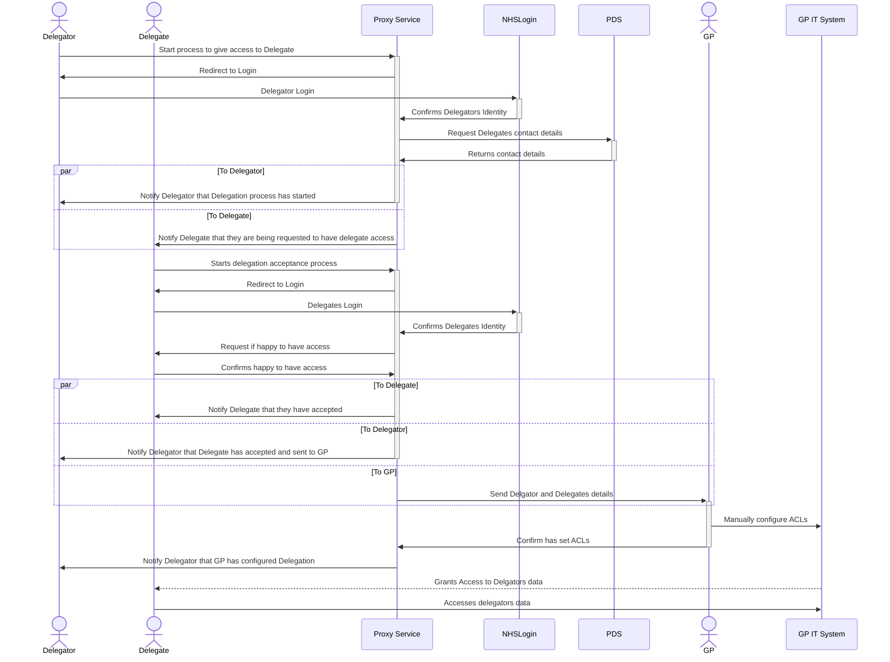

# Summary

# Non Technical Requirements

## Process Flow

# Benefits

# Technical Requirements

## Actors Involved

### Delgate

### Delegator

### GP Staff

## External Systems Involved

### NHS Login
- Used to authenticate the identity of both the delegator and delegate

### PDS
- Used to verify the delegate details provided by the delegator
- User to lookup the contact details (email or phone?) of the delegate

### Email / Mesh
- Used to communicate the proxy request to the GP surgery

## New Services / System Required

### NHS Proxy Service
Used to orchestrate 

## Data Inputs

### Delegates details (supplied by delegator)
- NHS Number
- Email
- Dob
- First Name
- Surname

### Delegates contact details 
Supplied from PDS Lookup

## Data Outputs

### To GP
- Delegator NHS Number
- Delegator Name
- Delegate NHS Number
- Delegate Name
- Date of request
- Date of request accepted

## Meta Data / Event / Command Data

### Delgation Process
- Started By
- Started Date
- Delegate Invite Sent Date
- Delegates Response
- Delegates Response Date
- Sent to GP Date
- Action Confirmed by GP (t/f)
- Action Confirmed by GP Date

## Commands

### Start Delegate Request

### Accept Delegation Request

### Decline Delegation Request

## Events

### Delegate Request Process Started

### Delegate Details Confirmed

### Delegate Contact Details Found

### Delegation Request Process Accepted

### Delegation Request Process Declined

## Processing / Validation

### Verify Delegates details (supplied by delegator) and lookup delegates contact details
Details for delegate that are supplied by delegator (i.e. who to "invite") should be verified against PDS

### Collate details for sending to GP

### All email/mesh notifications

# Todo / To consider

- Delegator Request cancel of Delegation
- Delegate Request cancel of Delegation
- GP Manually revoking delegation
- 