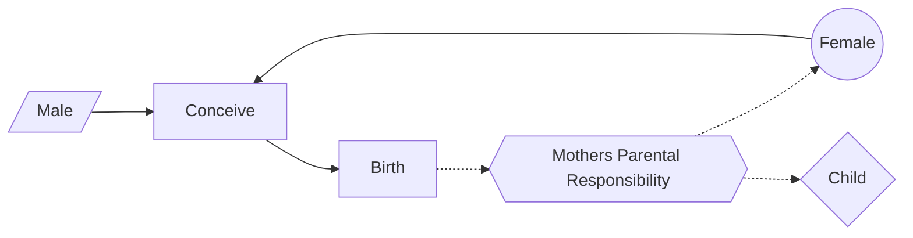
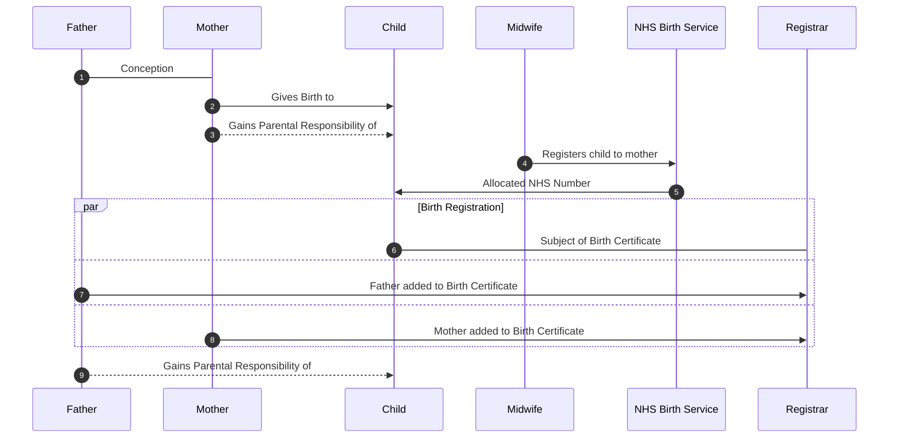
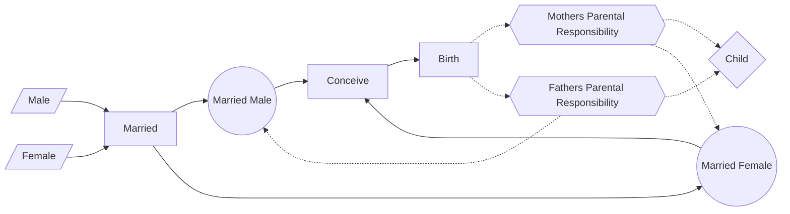
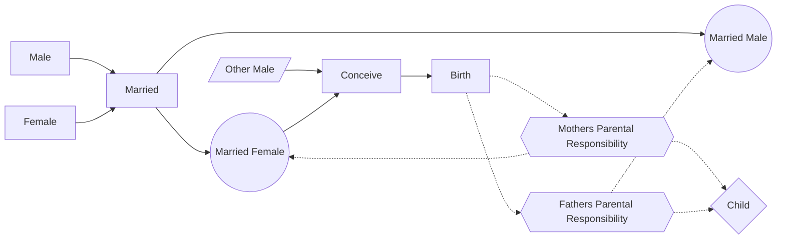
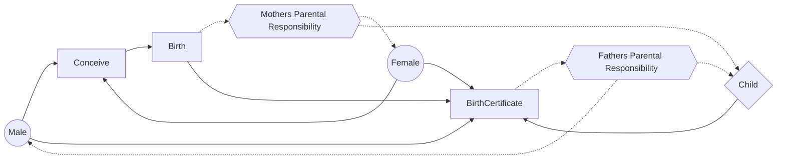
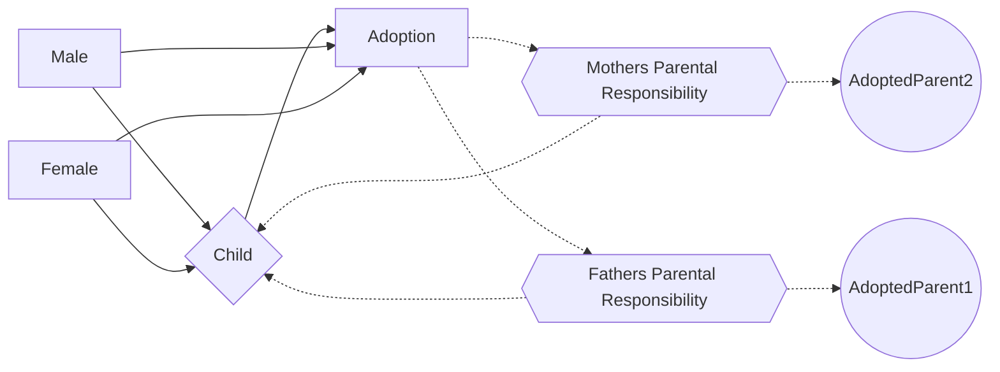

> ⚠️ **Warning**
>  
> **Draft Documents**: May not represent real world scenarios, may not be fully accurate or complete.
>
> Please contact the author for more information.

  

    Table of contents
  

  {: .text-delta }
1. TOC
{:toc}

## Relationships for Medical Record Access

|                                                                         | From                                 | To    | Proof                                          | Issuer |
| ----------------------------------------------------------------------- | ------------------------------------ | ----- | ---------------------------------------------- | ------ |
| [🔗]() | Biological Mother                    | Child | NHS "At Birth"                                 | NHS    |
|                                                                         | Parent                               | Child | Birth Certificate                              | GRO    |
|                                                                         | Parent                               | Child | Adoption Certificate                           | GRO    |
|                                                                         | Guardian                             | Child | Guardianship                                   | ???    |
|                                                                         | Married Partner of Biological Mother | Child | Marriage Certificate + (Mother to Child Proof) | GRO    |

# Diagrams of Parental Responsibility
**Key**
- Circle - Holder of rights
- Diamond - Subject of the rights
- Hexagon - Rights gained
- Parallelogram - Not a rights holder  
 ---

*Figure [^motherFatherUnmarried].  Unmarried Mother and Father  (child born after 2003)* 

*Figure [^motherFatherUnmarried].  Sequence Diagram for Unmarried Mother and Father  (child born after 2003)* 

---

*Figure [^marriedmotherandfather].  Married Mother and married biological Father* 

---

*Figure [^marriedmotherandotherfather].  Married Mother and other biological Father* 

---

*Figure [^motherFatherUnmarried-with-birth-cert].  Unmarried Mother and Father with birth certificate* 

---

*Figure [^adopted].  Child Adopted after birth* 

[^motherFatherUnmarried]: Unmarried Mother and Father (child born after 2003)
[^marriedmotherandfather]: Married Mother and biological Father
[^marriedmotherandotherfather]: Married Mother and other biological Father
[^motherFatherUnmarried-with-birth-cert]:  Unmarried Mother and Father with birth certificate
[^adopted]:  Child adopted after birth, adopted parents have PR