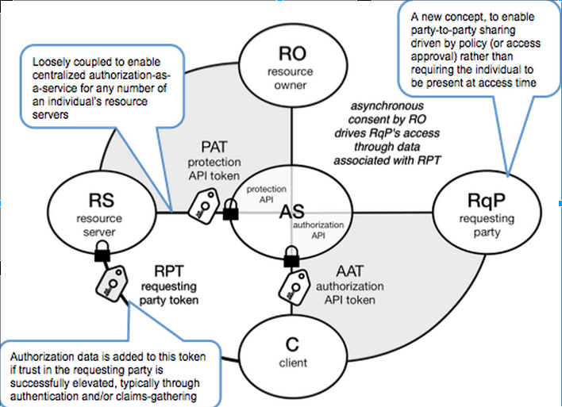

> ⚠️ **Warning**
>  
> **Draft Documents**: May not represent real world scenarios, may not be fully accurate or complete.
>
> Please contact the author for more information.

https://en.wikipedia.org/wiki/User-Managed_Access

https://docs.kantarainitiative.org/uma/wg/rec-oauth-uma-grant-2.0.html

https://www.forgerock.com/privacy/user-managed-access